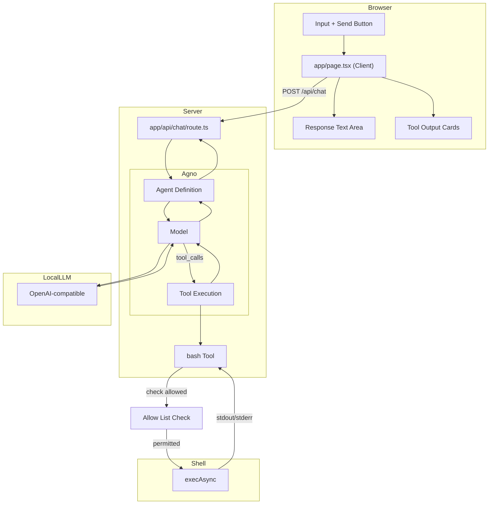

# Simple LLM Chat Interface

## Project Overview

A minimal chat interface that connects to a OpenAI-compatible LLM with bash execution capabilities. The app allows users to send prompts and receive responses, with the LLM able to invoke a `bash` tool to execute shell commands.

Built with Agno's agent-centric approach — an `Agent` is defined with a model, tools, and instructions, then executed via `run()`. Agno handles the tool calling loop, session management, and context building automatically.

---

## Architecture

```
┌─────────────────────────────────────────────────────────────┐
│                    User Browser                              │
│                                                             │
│  ┌───────────────────────────────────────────────────────┐  │
│  │              app/page.tsx (Client)                    │  │
│  │  ┌─────────────┐       ┌──────────────┐              │  │
│  │  │   Input     │──────▶│   Response   │              │  │
│  │  │   Text +    │       │   Text Area  │              │  │
│  │  │   Button    │       └──────────────┘              │  │
│  │  └─────────────┘                                     │  │
│  │        │                                             │  │
│  │        │ fetch POST /api/chat                        │  │
│  │        ▼                                             │  │
│  └───────────────────────────────────────────────────────┘  │
└─────────────────────────────────────────────────────────────┘
                        │
                        │ HTTP POST
                        ▼
┌─────────────────────────────────────────────────────────────┐
│              app/api/chat/route.ts                          │
│                                                             │
│  ┌─────────────────┐    ┌───────────────────────────────┐   │
│  │ Agent.run()     │───▶│ bash Tool (Python function)  │   │
│  │                 │    │  - type hints + docstring    │   │
│  │                 │    │  - execAsync(cmd, timeout)   │   │
│  │  ┌────────────┐ │    │  - 30s timeout              │   │
│  │  │   prompt   │ │    │  - returns stdout/stderr     │   │
│  │  └────────────┘ │    └───────────────────────────────┘   │
│  │        │        │    ▲                            │      │
│  │        └─────────┼────────────────────────────┘         │
│  │            │       │                                     │
│  │            ▼       │                                     │
│  │  ┌──────────────┐  │                                     │
│  │  │  RunOutput   │◀─┼─────────────────────────────────────┤
│  │  │  - content   │  │                                     │
│  │  │  - tool_calls────┘                                │      │
│  │  └──────────────┘                                   │      │
│  └─────────────────┘                                   │      │
│        │                                               │      │
└────────┼────────────────────────────────────────────────┘      │
         │                                                       │
         │ OpenAI-compatible API call                            │
         │ model string: "openai-compatible:model_name"          │
         │ tool_call_limit: 5                                    │
         │ Allow List Check                                      │
         │                                                       │
         ▼
┌────────────────────────────────────────────────────────────────────┐
│                    LLM via URL                                     │
└────────────────────────────────────────────────────────────────────┘
```

---

## Mermaid Architecture Diagram



---

## Technical Stack

| Layer | Technology | Version |
|-------|------------|---------|
| **Framework** | Next.js | 16.2.10 (App Router) |
| **UI** | React | 19.2.4 |
| **Agent Framework** | Agno (Python) | 2.x |
| **Validation** | Pydantic | 2.x |
| **Styling** | Tailwind CSS | v4 |
| **Type Safety** | TypeScript | 5.x |
| **Fonts** | Geist Sans/Mono | (via Tailwind v4) |

---

## Key Components

### `app/page.tsx`

**Type**: Client Component (`'use client'`)  
**Purpose**: Chat UI with input, response display, and tool output visualization

```tsx
useState hooks:
  - prompt: Input field value
  - response: LLM response text
  - toolOutputs: Array of bash tool execution results
  - loading: Button/input disabled state

send():
  - POST to /api/chat with { prompt }
  - Update response and toolOutputs on success
```

### `app/api/chat/route.ts`

**Type**: Server API Route (POST)  
**Purpose**: Orchestrate LLM inference via an Agno agent

```tsx
Key imports (Python):
  - Agent from agno.agent
  - Model from agno.models

Key exports:
  - POST(req: NextRequest)

Configuration:
  - model: Model string ("openai-compatible:model_name") with baseURL
  - tools: [bash_tool function]
  - agent: Agent with instructions, tool_call_limit
  - run(): agent.run(user=prompt) → RunOutput
```

### `app/globals.css`

**Type**: Global Styles  
**Purpose**: Tailwind v4 setup with system theme detection

```css
Tailwind v4 syntax:
  @import "tailwindcss"
  @theme inline { ... }

Features:
  - System color scheme detection (light/dark)
  - CSS custom properties for theming
  - Geist font family configuration
```

---

## LLM Configuration

```python
from agno.models import Model

model = Model(
    id="openai-compatible:modelName",
    api_key="example",
    base_url="baseUrl",
)
```

| Setting | Value |
|---------|-------|
| **Model ID** | `openai-compatible:modelName` |
| **Base URL** | `baseUrl` |
| **API Key** | `example` |
| **Provider Type** | OpenAI-compatible (via model string) |
| **Max Retries** | `0` (default) |

Configuration data is persisted to a file called llm-config.json

---

## Bash Tool Design

### Schema Definition

Agno builds tool definitions from Python function signatures — no explicit schema classes needed. Type hints and docstrings are automatically converted into tool schemas.

```python
from agno.run import RunContext
import subprocess

def bash_tool(command: str, run_context: RunContext = None) -> str:
    """Execute a bash command on the server.
    
    You MUST provide a "command" parameter with the exact shell command to run.
    This is the ONLY way to run commands. For example: command="pwd", 
    command="ls -la", command="npm run build".
    
    Args:
        command: The bash/shell command to execute
        run_context: Injected by Agno at runtime (not sent to model)
        
    Returns:
        JSON string with stdout, stderr, and optional error
    """
    # Allow list check
    base_cmd = command.split()[0] if command.strip() else ""
    if base_cmd not in ALLOW_LIST and not ALLOW_ALL:
        return json.dumps({"error": f"Command '{base_cmd}' not allowed", "stdout": "", "stderr": ""})
    
    try:
        result = subprocess.run(
            command, shell=True, capture_output=True, text=True, timeout=30
        )
        return json.dumps({
            "stdout": result.stdout.strip(),
            "stderr": result.stderr.strip()
        })
    except subprocess.TimeoutExpired:
        return json.dumps({"error": "Command timed out (30s)", "stdout": "", "stderr": ""})
    except Exception as e:
        return json.dumps({"error": str(e), "stdout": "", "stderr": ""})
```

### Execution Configuration

| Setting | Value |
|---------|-------|
| **Command Runner** | `subprocess.run()` (synchronous) |
| **Timeout** | 30,000 ms (30 seconds) |
| **Captured Output** | `stdout`, `stderr`, `error` |
| **tool_call_limit** | 5 (max tool calls per run) |

### Allow List Filtering

The bash tool enforces an allow list that restricts which commands can be executed. Before running a command, the tool checks if the base command (first word) is in the allow list.

### Return Types

Agno tools return a **string** (or any serializable value) that gets added to the model context:

```python
# Success (returned as string)
json.dumps({
    "stdout": str,    # Trimmed
    "stderr": str     # Trimmed
})

# Error (returned as string)
json.dumps({
    "error": str,     # Error message
    "stdout": str,    # Trimmed (may be partial)
    "stderr": str     # Trimmed
})
```

---

## Command Allow List

### Default Allow List

By default, the allow list includes:
- `ls` - List directory contents
- `pwd` - Print working directory

### User Editable

Users can modify the allow list through the web app UI:
- **Add commands**: Enter a new command to add it to the list
- **Remove commands**: Click the remove button next to any command

### Allow All Mode

A toggle setting enables "Allow All" mode:
- **Enabled**: The allow list is ignored; any command the LLM generates will execute
- **Disabled**: Only commands in the allow list are permitted

---

## Design Patterns

### 1. Client-Server Separation

- **Client** (`page.tsx`): UI-only, no API credentials
- **Server** (`api/chat/route.ts`): Holds API key, makes LLM calls
- **Benefit**: API key never exposed to browser

### 2. Agno Agent Pattern

```python
from agno.agent import Agent
from agno.models import Model

# Step 1: Define the model
model = Model(
    id="openai-compatible:modelName",
    api_key="example",
    base_url="baseUrl",
)

# Step 2: Define the agent with tools, instructions, and config
agent = Agent(
    name="chat-agent",
    model=model,
    tools=[bash_tool],
    instructions=[
        "You are a helpful assistant that can execute bash commands on the server.",
        "Use the bash tool to run commands and return the results to the user.",
        "Always explain what you did after running commands.",
    ],
    tool_call_limit=5,  # Maximum tool calls per run
    add_session_state_to_context=True,
    add_history_to_context=True,
    num_history_runs=3,
    stream=False,       # Set True for streaming responses
    debug_mode=False,
)

# Step 3: Run the agent
result = agent.run(user=prompt)

# Step 4: Access results
final_response = result.content          # Final text response
tool_calls = result.tool_calls           # List of tool calls made
tool_results = [tc.result for tc in tool_calls]  # Tool execution results
```

**Key Agno concepts used**:
- `Agent` — the core primitive; encapsulates model, tools, instructions, sessions, memory
- `tools=[bash_tool]` — Python functions are auto-wrapped as tools (no explicit class needed)
- `tool_call_limit=5` — limits total tool calls in a single run
- `instructions` — system prompt as string or list of strings
- `add_history_to_context=True` — includes conversation history in context
- `num_history_runs=3` — how many past runs to include
- `add_session_state_to_context=True` — persists state across runs via database
- `stream=True` — enables streaming mode (SSE)
- `agent.run(user=prompt)` — synchronous execution returns `RunOutput`
- `agent.arun(user=prompt)` — async execution (returns `Awaitable[RunOutput]`)
- `RunOutput` — contains `content` (final response), `tool_calls` (list of executed tools), `followups` (suggested next prompts)
- `run_context: RunContext` — special parameter auto-injected by Agno (not sent to model)
- `ToolResult` — can include text plus media artifacts (images, videos, audio, files)

### 3. Tool Output Visualization

```tsx
result.tool_calls[]:
  ├─ stdout → Green-tinted card with dark terminal background
  ├─ stderr → Red-tinted card for error streams
  └─ error  → Inline error message (execution failed)
```

---

## Key Dependencies

```json
{
  "dependencies": {
    "agno": "^2.x",
    "next": "16.2.10",
    "react": "19.2.4",
    "react-dom": "19.2.4"
  },
  "devDependencies": {
    "@tailwindcss/postcss": "^4",
    "@types/node": "^20",
    "@types/react": "^19",
    "@types/react-dom": "^19",
    "eslint": "^9",
    "eslint-config-next": "16.2.10",
    "tailwindcss": "^4",
    "typescript": "^5"
  }
}
```

---

## Development Workflow

```bash
# Start development server (Python backend + Next.js frontend)
bun dev

# Build for production
bun build

# Run production server
bun start
```

Access at `http://localhost:3000`

---

## Data Flow Summary

1. **User** types prompt and clicks Send
2. **Client** sends `POST /api/chat` with `{ prompt }`
3. **API Route** creates an Agno `Agent` with model, bash tool, and instructions
4. **Agent** calls `agent.run(user=prompt)`
5. **Agent** sends context + tool definitions to the LLM
6. **LLM** processes prompt, may request tool calls
7. **Agno** validates arguments, executes `bash_tool()` (30s timeout)
   - **Allow List Check** verifies the base command is permitted (or "Allow All" is enabled)
8. **Tool results** added to model context; loop continues
9. **Agent** repeats up to `tool_call_limit=5`, then returns final response
10. **API Route** returns `{ text, toolOutputs[] }` extracted from `RunOutput`
11. **Client** displays response text and tool output cards

---

## UI Behavior

### Autoscroll Behavior
- Uses `useLayoutEffect` + `setTimeout(..., 0)` pattern to autoscroll chat to bottom
- Triggers on changes to `messages` array or `loading` state
- Scrolls by setting `container.scrollTop = scrollHeight`
- This is a hard jump (no smooth scrolling animation)
- Unconditionally scrolls user back to bottom even if they scrolled up mid-conversation
- No scroll preservation or intersection observer for smart scrolling

### Chat Container Styling
- `flex-1 min-h-0 overflow-y-auto px-8 py-6 pb-20 space-y-6`
- `overflow-y-auto` enables scrolling
- `pb-20` provides bottom padding so content isn't hidden behind the sticky input bar

### Input Bar Behavior
- `sticky bottom-0` keeps input bar fixed at bottom of chat card
- Has `data-input-bar` attribute

### Typing Indicator Animation
- Three dots with staggered `animate-bounce` (Tailwind CSS)
- Animation delays: 0ms, 150ms, 300ms

### Other UI Effects
- Dark mode toggle: `transition-colors` on button
- Input field: `transition-shadow` on focus
- Send button: `transition-all` + `active:scale-[0.98]` press feedback
- Send button disabled state: `disabled:opacity-40`

### Notes on Scrolling
- No `smooth` scrolling — hard jump via direct scrollTop assignment
- No scroll preservation — user is always scrolled to bottom on new messages
- No `scrollIntoView` with `behavior: 'smooth'`
- No intersection observer or smart scroll detection

---

## Future Considerations

- **Sessions**: Use `agent.run(session_id="chat-123")` for multi-turn conversation persistence
- **Database-backed state**: Connect a SQLite/Postgres DB for session/memory/knowledge persistence
- **Streaming**: Set `stream=True` + `stream_events=True` for SSE streaming of intermediate steps
- **Teams**: Wrap the agent in a `Team` for role-based multi-agent workflows
- **Workflows**: Use Agno's `Workflow` primitive for branching, looping, and parallel execution
- **Memory**: Enable `enable_agentic_memory=True` for persistent user facts
- **Knowledge**: Add RAG via the `knowledge` parameter (search over documents/URLs)
- **Guardrails**: Add input/output validation via `pre_hooks` and `post_hooks`
- **Human-in-the-loop**: Mark tools with `requires_confirmation=True` for approval workflows
- **Observability**: Enable OpenTelemetry tracing for production monitoring
- **AgentOS**: Deploy agents via Agno's AgentOS runtime for REST APIs, auth, and scheduling

---
