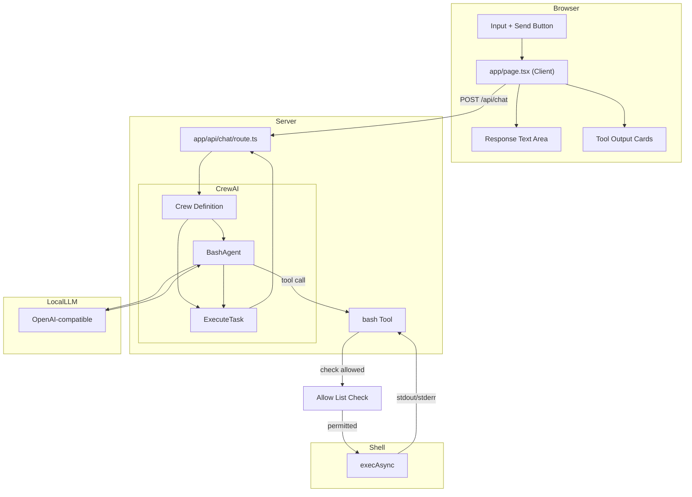

# Simple LLM Chat Interface

## Project Overview

A minimal chat interface that connects to a OpenAI-compatible LLM with bash execution capabilities. The app allows users to send prompts and receive responses, with the LLM able to invoke a `bash` tool to execute shell commands.

Built with CrewAI's multi-agent orchestration — a single `BashAgent` is defined with a role, goal, and backstory, equipped with a `bash` tool and governed by an allow list. The agent is assembled into a `Crew` and tasked to execute user requests.

---

## Architecture

```
┌─────────────────────────────────────────────────────────────┐
│                    User Browser                              │
│                                                             │
│  ┌───────────────────────────────────────────────────────┐  │
│  │              app/page.tsx (Client)                    │  │
│  │  ┌─────────────┐       ┌──────────────┐              │  │
│  │  │   Input     │──────▶│   Response   │              │  │
│  │  │   Text +    │       │   Text Area  │              │  │
│  │  │   Button    │       └──────────────┘              │  │
│  │  └─────────────┘                                     │  │
│  │        │                                             │  │
│  │        │ fetch POST /api/chat                        │  │
│  │        ▼                                             │  │
│  └───────────────────────────────────────────────────────┘  │
└─────────────────────────────────────────────────────────────┘
                        │
                        │ HTTP POST
                        ▼
┌─────────────────────────────────────────────────────────────┐
│              app/api/chat/route.ts                          │
│                                                             │
│  ┌─────────────────┐    ┌───────────────────────────────┐   │
│  │ CrewAI Crew     │───▶│ bash Tool                   │   │
│  │ .keras()        │    │  - zod input schema          │   │
│  │                 │    │  - execAsync(cmd, timeout)   │   │
│  │  ┌────────────┐ │    │  - 30s timeout              │   │
│  │  │   prompt   │ │    │  - returns stdout/stderr     │   │
│  │  └────────────┘ │    └───────────────────────────────┘   │
│  │        │        │    ▲                            │      │
│  │        └─────────┼────────────────────────────┘         │
│  │            │       │                                     │
│  │            ▼       │                                     │
│  │  ┌──────────────┐  │                                     │
│  │  │  Return JSON │◀─┼─────────────────────────────────────┤
│  │  │  - text      │  │                                     │
│  │  │  - toolCalls────┘                                │      │
│  │  └──────────────┘                                   │      │
│  └─────────────────┘                                   │      │
│        │                                               │      │
└────────┼────────────────────────────────────────────────┘      │
         │                                                       │
         │ OpenAI-compatible API call                            │
         │ max_l Tokens: 5 (max iterations)                      │
         │ Allow List Check                                      │
         │                                                       │
         ▼
┌────────────────────────────────────────────────────────────────────┐
│                    LLM via URL                                     │
└────────────────────────────────────────────────────────────────────┘
```

---

## Mermaid Architecture Diagram



---

## Technical Stack

| Layer | Technology | Version |
|-------|------------|---------|
| **Framework** | Next.js | 16.2.10 (App Router) |
| **UI** | React | 19.2.4 |
| **Agent Framework** | CrewAI | 2.x |
| **Validation** | Zod | 3.25.0 |
| **Styling** | Tailwind CSS | v4 |
| **Type Safety** | TypeScript | 5.x |
| **Fonts** | Geist Sans/Mono | (via Tailwind v4) |

---

## Key Components

### `app/page.tsx`

**Type**: Client Component (`'use client'`)  
**Purpose**: Chat UI with input, response display, and tool output visualization

```tsx
useState hooks:
  - prompt: Input field value
  - response: LLM response text
  - toolOutputs: Array of bash tool execution results
  - loading: Button/input disabled state

send():
  - POST to /api/chat with { prompt }
  - Update response and toolOutputs on success
```

### `app/api/chat/route.ts`

**Type**: Server API Route (POST)  
**Purpose**: Orchestrate LLM inference via a CrewAI agent crew

```tsx
Key imports:
  - { Agent } from "crewai"
  - { Task } from "crewai"
  - { Crew } from "crewai"
  - { z } from "zod"

Key exports:
  - POST(req: NextRequest)

Configuration:
  - model: OpenAI-compatible via CrewAI's llm config
  - tools: [bashTool]
  - agent: BashAgent with role, goal, backstory
  - task: ExecuteTask describing the user prompt
  - crew: Crew orchestrating agent + task
  - maxIter: 5 (via process config)
```

### `app/globals.css`

**Type**: Global Styles  
**Purpose**: Tailwind v4 setup with system theme detection

```css
Tailwind v4 syntax:
  @import "tailwindcss"
  @theme inline { ... }

Features:
  - System color scheme detection (light/dark)
  - CSS custom properties for theming
  - Geist font family configuration
```

---

## LLM Configuration

```ts
const llm = {
  modelName: 'modelName',
  baseUrl: 'baseUrl',
  apiKey: 'example',
  maxTokens: 4096,
};
```

| Setting | Value |
|---------|-------|
| **Model** | `modelName` |
| **Base URL** | `baseUrl` |
| **API Key** | `example` |
| **Provider Type** | OpenAI-compatible (via CrewAI's native config) |
| **Max Tokens** | `4096` (context window limit) |

Configuration data is persisted to a file called llm-config.json

---

## Bash Tool Design

### Schema Definition

```ts
import { z } from "zod";
import { Tool } from "crewai/tools";

class BashTool extends Tool {
  name = "bash";
  description = `Execute a bash command on the server. You MUST provide a "command" 
  parameter with the exact shell command to run. This is the ONLY way to run 
  commands. For example: command="pwd", command="ls -la", command="npm run build".`;
  
  schema = z.object({
    command: z.string().describe('The bash/shell command to execute'),
  });
  
  async _run(input: z.infer<typeof this.schema>): Promise<string> {
    const { command } = input;
    // ... execute and return result
  }
}
```

### Execution Configuration

| Setting | Value |
|---------|-------|
| **Command Runner** | `child_process.exec` (promisified) |
| **Timeout** | 30,000 ms (30 seconds) |
| **Captured Output** | `stdout`, `stderr`, `error` |
| **maxIter** | 5 (multi-step reasoning) |

### Allow List Filtering

The bash tool enforces an allow list that restricts which commands can be executed. Before running a command, the tool checks if the base command (first word) is in the allow list.

### Return Types

CrewAI tools return a **string** that gets returned to the agent as a result. The string representation:

```ts
// Success (returned as string)
JSON.stringify({
  stdout: string,  // Trimmed
  stderr: string   // Trimmed
})

// Error (returned as string)
JSON.stringify({
  error: string,   // Error message
  stdout: string,  // Trimmed (may be partial)
  stderr: string   // Trimmed
})
```

---

## Command Allow List

### Default Allow List

By default, the allow list includes:
- `ls` - List directory contents
- `pwd` - Print working directory

### User Editable

Users can modify the allow list through the web app UI:
- **Add commands**: Enter a new command to add it to the list
- **Remove commands**: Click the remove button next to any command

### Allow All Mode

A toggle setting enables "Allow All" mode:
- **Enabled**: The allow list is ignored; any command the LLM generates will execute
- **Disabled**: Only commands in the allow list are permitted

---

## Design Patterns

### 1. Client-Server Separation

- **Client** (`page.tsx`): UI-only, no API credentials
- **Server** (`api/chat/route.ts`): Holds API key, makes LLM calls
- **Benefit**: API key never exposed to browser

### 2. CrewAI Agent Pattern

```tsx
// Step 1: Define the agent with role, goal, and backstory
const bashAgent = new Agent({
  role: 'Command Executor',
  goal: 'Execute bash commands accurately and return results to the user',
  backstory: `You are a helpful assistant that can execute bash commands on a server. 
  You are given commands to run and you execute them safely using an allow list. 
  You always return the command output clearly.`,
  llm: modelConfig,
  tools: [new BashTool()],
  allowDelegation: false,
  maxIter: 5,
});

// Step 2: Define the task that describes the user's request
const executeTask = new Task({
  description: `Execute the following user request: ${prompt}. 
  Use the bash tool to run any commands needed and return the complete result.`,
  expectedOutput: 'A clear response containing the command outputs and explanation',
  agent: bashAgent,
});

// Step 3: Assemble the crew
const crew = new Crew({
  agents: [bashAgent],
  tasks: [executeTask],
  process: 'sequential',  // or 'hierarchical'
  verbose: false,
  maxIter: 5,
});

// Step 4: Execute
const result = await crew.kickoff();
// result.raw contains the agent's final output
```

**Key CrewAI concepts used**:
- `Agent` — defines an agent's role, goal, backstory, tools, and LLM config
- `Task` — describes what needs to be done, its expected output, and which agent performs it
- `Crew` — orchestrates agents and tasks using a process (sequential, hierarchical)
- `kickoff()` — executes the crew and returns results
- `process: 'sequential'` — tasks execute in order (suitable for single-agent chat)
- `process: 'hierarchical'` — manager agent delegates to worker agents (overkill for single-agent chat)
- `maxIter` — limits the number of tool call/response cycles per task
- Tool results are automatically passed back to the agent for next iteration

### 3. Tool Output Visualization

```tsx
result.raw.split('\n'):
  ├─ stdout → Green-tinted card with dark terminal background
  ├─ stderr → Red-tinted card for error streams
  └─ error  → Inline error message (execution failed)
```

---

## Key Dependencies

```json
{
  "dependencies": {
    "crewai": "^2.x",
    "zod": "^3.25.0",
    "next": "16.2.10",
    "react": "19.2.4",
    "react-dom": "19.2.4"
  },
  "devDependencies": {
    "@tailwindcss/postcss": "^4",
    "@types/node": "^20",
    "@types/react": "^19",
    "@types/react-dom": "^19",
    "eslint": "^9",
    "eslint-config-next": "16.2.10",
    "tailwindcss": "^4",
    "typescript": "^5"
  }
}
```

---

## Development Workflow

```bash
# Start development server
bun dev

# Build for production
bun build

# Run production server
bun start
```

Access at `http://localhost:3000`

---

## Data Flow Summary

1. **User** types prompt and clicks Send
2. **Client** sends `POST /api/chat` with `{ prompt }`
3. **API Route** creates a CrewAI `Agent` with role, goal, backstory, and bash tool
4. **API Route** creates a `Task` describing the user prompt
5. **API Route** assembles a `Crew` with the agent and task
6. **Crew** executes via `kickoff()` — the agent processes the prompt
7. **Agent** may call bash tool (up to `maxIter: 5` times)
8. **Bash Tool** executes command via `execAsync()` (30s timeout)
   - **Allow List Check** verifies the base command is permitted (or "Allow All" is enabled)
9. **Agent** collects tool results and iterates until final answer
10. **Crew** returns result via `kickoff()`
11. **API Route** returns `{ text, toolOutputs[] }` extracted from the crew result
12. **Client** displays response text and tool output cards

---

## UI Behavior

### Autoscroll Behavior
- Uses `useLayoutEffect` + `setTimeout(..., 0)` pattern to autoscroll chat to bottom
- Triggers on changes to `messages` array or `loading` state
- Scrolls by setting `container.scrollTop = scrollHeight`
- This is a hard jump (no smooth scrolling animation)
- Unconditionally scrolls user back to bottom even if they scrolled up mid-conversation
- No scroll preservation or intersection observer for smart scrolling

### Chat Container Styling
- `flex-1 min-h-0 overflow-y-auto px-8 py-6 pb-20 space-y-6`
- `overflow-y-auto` enables scrolling
- `pb-20` provides bottom padding so content isn't hidden behind the sticky input bar

### Input Bar Behavior
- `sticky bottom-0` keeps input bar fixed at bottom of chat card
- Has `data-input-bar` attribute

### Typing Indicator Animation
- Three dots with staggered `animate-bounce` (Tailwind CSS)
- Animation delays: 0ms, 150ms, 300ms

### Other UI Effects
- Dark mode toggle: `transition-colors` on button
- Input field: `transition-shadow` on focus
- Send button: `transition-all` + `active:scale-[0.98]` press feedback
- Send button disabled state: `disabled:opacity-40`

### Notes on Scrolling
- No `smooth` scrolling — hard jump via direct scrollTop assignment
- No scroll preservation — user is always scrolled to bottom on new messages
- No `scrollIntoView` with `behavior: 'smooth'`
- No intersection observer or smart scroll detection

---

## Future Considerations

- Multi-agent crews: Add a `ResearcherAgent` and `SummarizerAgent` working in parallel
- Process modes: Switch to `process: 'hierarchical'` for manager/worker delegation
- Add streaming via CrewAI's `stream()` or `asyncKoff()`
- Support multi-turn conversation history via task context
- Add request/response logging
- Configure environment variables for API credentials
- Add loading states for individual agent steps
- Support streaming tool outputs via SSE
- Add team-based allow list defaults via shared agent config
- Add memory/persistence via CrewAI's memory feature

---

## CrewAI vs Vercel AI SDK: Key Mapping

| Vercel AI SDK | CrewAI |
|---------------|--------|
| `generateText()` | `Crew.kickoff()` |
| `tool({ parameters, execute })` | `class extends Tool { schema, _run() }` |
| `maxSteps: 5` | `maxIter: 5` in agent/crew config |
| Tool result as object | Tool result as JSON string |
| Built-in streaming (`useChat`) | `crew.stream()` / `crew.asyncKoff()` |
| Auto message history | Agent retains conversation context |
| Implicit tool routing | Agent internally manages tool calls |
| `ai` package | `crewai` package |
| Single function call | Three-layer abstraction: Agent → Task → Crew |

## CrewAI vs LangChain: Key Mapping

| LangChain (createReactAgent) | CrewAI |
|------------------------------|--------|
| `createReactAgent({ llm, tools })` | `new Agent() → new Task() → new Crew()` |
| `StateGraph` with nodes/edges | Implicit agent loop managed by Crew |
| `maxIterations: 5` | `maxIter: 5` |
| `MemorySaver` / `SqliteSaver` | CrewAI built-in memory |
| `invoke()` | `kickoff()` |
| `stream()` | `stream()` / `asyncKoff()` |
| Explicit message management | Crew handles message context |
| `thread_id` in configurable | Task-level context sharing |
| State machine (explicit) | Agent orchestration (declarative) |
