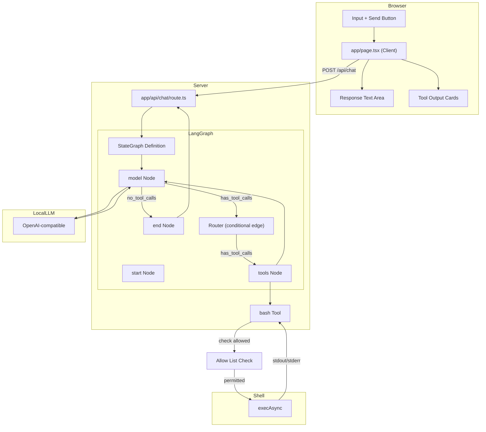

# Simple LLM Chat Interface

## Project Overview

A minimal chat interface that connects to a OpenAI-compatible LLM with bash execution capabilities. The app allows users to send prompts and receive responses, with the LLM able to invoke a `bash` tool to execute shell commands.

Built with LangGraph's explicit state machine approach — state, nodes, and edges are all defined by hand, giving full control over the agent's execution graph.

---

## Architecture

```
┌─────────────────────────────────────────────────────────────┐
│                    User Browser                              │
│                                                             │
│  ┌───────────────────────────────────────────────────────┐  │
│  │              app/page.tsx (Client)                    │  │
│  │  ┌─────────────┐       ┌──────────────┐              │  │
│  │  │   Input     │──────▶│   Response   │              │  │
│  │  │   Text +    │       │   Text Area  │              │  │
│  │  │   Button    │       └──────────────┘              │  │
│  │  └─────────────┘                                     │  │
│  │        │                                             │  │
│  │        │ fetch POST /api/chat                        │  │
│  │        ▼                                             │  │
│  └───────────────────────────────────────────────────────┘  │
└─────────────────────────────────────────────────────────────┘
                        │
                        │ HTTP POST
                        ▼
┌─────────────────────────────────────────────────────────────┐
│              app/api/chat/route.ts                          │
│                                                             │
│  ┌─────────────────┐    ┌───────────────────────────────┐   │
│  │ StateGraph      │───▶│ bash Tool                   │   │
│  │ .addNode()      │    │  - zod input schema          │   │
│  │ .compile()      │    │  - execAsync(cmd, timeout)   │   │
│  │ .invoke()       │    │  - 30s timeout              │   │
│  │                 │    │  - returns stdout/stderr     │   │
│  │  ┌────────────┐ │    └───────────────────────────────┘   │
│  │  │   prompt   │ │    ▲                            │      │
│  │  └────────────┘ │    │                            │      │
│  │        │        └────┼────────────────────────────┘         │
│  │        └─────────────┼────────────────────────────┘         │
│  │            │         │                                     │
│  │            ▼         │                                     │
│  │  ┌──────────────┐    │                                     │
│  │  │  Return JSON │◀───┼─────────────────────────────────────┤
│  │  │  - text      │    │                                     │
│  │  │  - toolCalls─────┘                                │      │
│  │  └──────────────┘                                   │      │
│  └─────────────────┘                                   │      │
│        │                                               │      │
└────────┼────────────────────────────────────────────────┘      │
         │                                                       │
         │ OpenAI-compatible API call                            │
         │ max_iterations: 5                                     │
         │ Allow List Check                                      │
         │                                                       │
         ▼
┌────────────────────────────────────────────────────────────────────┐
│                    LLM via URL                                     │
└────────────────────────────────────────────────────────────────────┘
```

---

## Mermaid Architecture Diagram



---

## Technical Stack

| Layer | Technology | Version |
|-------|------------|---------|
| **Framework** | Next.js | 16.2.10 (App Router) |
| **UI** | React | 19.2.4 |
| **Graph Agent Framework** | LangGraph.js | 0.2.x |
| **Core** | @langchain/core | 0.3.x |
| **Provider** | @langchain/openai | 0.3.x |
| **Validation** | Zod | 3.25.0 |
| **Styling** | Tailwind CSS | v4 |
| **Type Safety** | TypeScript | 5.x |
| **Fonts** | Geist Sans/Mono | (via Tailwind v4) |

---

## Key Components

### `app/page.tsx`

**Type**: Client Component (`'use client'`)  
**Purpose**: Chat UI with input, response display, and tool output visualization

```tsx
useState hooks:
  - prompt: Input field value
  - response: LLM response text
  - toolOutputs: Array of bash tool execution results
  - loading: Button/input disabled state

send():
  - POST to /api/chat with { prompt }
  - Update response and toolOutputs on success
```

### `app/api/chat/route.ts`

**Type**: Server API Route (POST)  
**Purpose**: Orchestrate LLM inference via a LangGraph state machine

```tsx
Key imports:
  - ChatOpenAI from @langchain/openai
  - { StateGraph, MessagesAnnotation } from "@langchain/langgraph"
  - { ToolMessage, AIMessage, HumanMessage } from "@langchain/core/messages"
  - { z } from "zod"

Key exports:
  - POST(req: NextRequest)

Configuration:
  - model: ChatOpenAI with openai-compatible baseURL
  - tools: [bashTool]
  - graph: explicit StateGraph with model node + tools node
  - maxIterations: 5 (via graph config)
```

### `app/globals.css`

**Type**: Global Styles  
**Purpose**: Tailwind v4 setup with system theme detection

```css
Tailwind v4 syntax:
  @import "tailwindcss"
  @theme inline { ... }

Features:
  - System color scheme detection (light/dark)
  - CSS custom properties for theming
  - Geist font family configuration
```

---

## LLM Configuration

```ts
const model = new ChatOpenAI({
  modelName: 'modelName',
  baseUrl: 'baseUrl',
  apiKey: 'example',
  configuration: {
    maxRetries: 0,
  },
});
```

| Setting | Value |
|---------|-------|
| **Model** | `modelName` |
| **Base URL** | `baseUrl` |
| **API Key** | `example` |
| **Provider Type** | OpenAI-compatible (via `@langchain/openai`) |
| **Max Retries** | `0` (no retries) |

Configuration data is persisted to a file called llm-config.json

---

## Bash Tool Design

### Schema Definition

```ts
import { z } from "zod";
import { Tool } from "@langchain/core/tools";

class BashTool extends Tool {
  name = "bash";
  description = `Execute a bash command on the server. You MUST provide a "command" 
  parameter with the exact shell command to run. This is the ONLY way to run 
  commands. For example: command="pwd", command="ls -la", command="npm run build".`;
  
  schema = z.object({
    command: z.string().describe('The bash/shell command to execute'),
  });
  
  async _call(input: z.infer<typeof this.schema>): Promise<string> {
    const { command } = input;
    // ... execute and return result
  }
}
```

### Execution Configuration

| Setting | Value |
|---------|-------|
| **Command Runner** | `child_process.exec` (promisified) |
| **Timeout** | 30,000 ms (30 seconds) |
| **Captured Output** | `stdout`, `stderr`, `error` |
| **maxIterations** | 5 (multi-step reasoning) |

### Allow List Filtering

The bash tool enforces an allow list that restricts which commands can be executed. Before running a command, the tool checks if the base command (first word) is in the allow list.

### Return Types

LangChain tools return a **string** that gets wrapped in a `ToolMessage`. The string representation:

```ts
// Success (returned as string)
JSON.stringify({
  stdout: string,  // Trimmed
  stderr: string   // Trimmed
})

// Error (returned as string)
JSON.stringify({
  error: string,   // Error message
  stdout: string,  // Trimmed (may be partial)
  stderr: string   // Trimmed
})
```

---

## Command Allow List

### Default Allow List

By default, the allow list includes:
- `ls` - List directory contents
- `pwd` - Print working directory

### User Editable

Users can modify the allow list through the web app UI:
- **Add commands**: Enter a new command to add it to the list
- **Remove commands**: Click the remove button next to any command

### Allow All Mode

A toggle setting enables "Allow All" mode:
- **Enabled**: The allow list is ignored; any command the LLM generates will execute
- **Disabled**: Only commands in the allow list are permitted

---

## Design Patterns

### 1. Client-Server Separation

- **Client** (`page.tsx`): UI-only, no API credentials
- **Server** (`api/chat/route.ts`): Holds API key, makes LLM calls
- **Benefit**: API key never exposed to browser

### 2. LangGraph State Machine Pattern

```tsx
// Step 1: Define the shared state schema (extends LangGraph's built-in messages annotation)
import { Annotation, MessagesAnnotation } from "@langchain/langgraph";

const ChatAnnotation = Annotation.Root({
  ...MessagesAnnotation.spec,  // inherits messages array
  allowList: Annotation<string[]>({
    reducer: (state, update) => update,
    default: () => ["ls", "pwd"],
  }),
  allowAll: Annotation<boolean>({
    reducer: (state, update) => update ?? false,
    default: () => false,
  }),
});

// Step 2: Define node functions
async function modelNode(state: typeof ChatAnnotation.State) {
  const response = await model.invoke(state.messages);
  return { messages: [response] };
}

// Step 3: Define the tools node (handles tool calling + execution)
async function toolsNode(state: typeof ChatAnnotation.State) {
  const toolMessages = await convertToAnimatedFormat(...);
  return { messages: toolMessages };
}

// Step 4: Conditional router — should we call tools or return?
function routeResponse(state: typeof ChatAnnotation.State) {
  const lastMessage = state.messages[state.messages.length - 1];
  if ("tool_calls" in lastMessage && lastMessage.tool_calls?.length > 0) {
    return "tools";
  }
  return "__end__";
}

// Step 5: Build the graph
const graph = new StateGraph(ChatAnnotation)
  .addNode("model", modelNode)
  .addNode("tools", toolsNode)
  .addEdge("__start__", "model")
  .addConditionalEdges("model", routeResponse, {
    tools: "tools",
    __end__: "__end__",
  })
  .addEdge("tools", "model")
  .compile({
    checkpointSaver: new MemorySaver(),
    maxIter: 5,
    name: "chat-agent",
  });

// Step 6: Invoke
const result = await graph.invoke({
  messages: [new HumanMessage(prompt)],
  allowList: ["ls", "pwd"],
  allowAll: false,
}, {
  configurable: {
    thread_id: "chat-session-id",
  },
});
```

**Key LangGraph concepts used**:
- `Annotation.Root` / `MessagesAnnotation` — define a typed, persistent state schema
- `addNode()` — each node is an async function that receives state and returns partial state updates
- `addConditionalEdges()` — dynamic routing based on state (e.g., "has tool calls?" → loop back to model)
- `addEdge()` — fixed transitions (tools → model, start → model)
- `.compile()` — produces an executable graph with checkpointing
- `MemorySaver` / `SqliteSaver` / `PostgresSaver` — persistent state across invocations (thread-safe)
- `maxIter` — limits graph iterations to prevent infinite loops
- `thread_id` — enables multi-conversation state isolation

### 3. Tool Output Visualization

```tsx
result.messages[].toolCalls[]:
  ├─ stdout → Green-tinted card with dark terminal background
  ├─ stderr → Red-tinted card for error streams
  └─ error  → Inline error message (execution failed)
```

---

## Key Dependencies

```json
{
  "dependencies": {
    "@langchain/core": "^0.3.x",
    "@langchain/langgraph": "^0.2.x",
    "@langchain/openai": "^0.3.x",
    "zod": "^3.25.0",
    "next": "16.2.10",
    "react": "19.2.4",
    "react-dom": "19.2.4"
  },
  "devDependencies": {
    "@tailwindcss/postcss": "^4",
    "@types/node": "^20",
    "@types/react": "^19",
    "@types/react-dom": "^19",
    "eslint": "^9",
    "eslint-config-next": "16.2.10",
    "tailwindcss": "^4",
    "typescript": "^5"
  }
}
```

---

## Development Workflow

```bash
# Start development server
bun dev

# Build for production
bun build

# Run production server
bun start
```

Access at `http://localhost:3000`

---

## Data Flow Summary

1. **User** types prompt and clicks Send
2. **Client** sends `POST /api/chat` with `{ prompt }`
3. **API Route** builds a LangGraph `StateGraph` with `model` node + `tools` node
4. **Graph** starts at `model` node, invoking the LLM with the prompt
5. **LLM** processes prompt and may emit tool calls
6. **Router** checks `lastMessage.tool_calls` — if present, routes to `tools` node
7. **Tools Node** executes each tool (bash command via `execAsync()`, 30s timeout)
   - **Allow List Check** verifies the base command is permitted (or "Allow All" is enabled)
8. **Graph** loops back to `model` node with tool results
9. **Graph** repeats up to `maxIter: 5` times, then ends
10. **API Route** returns `{ text, toolOutputs[] }` extracted from final state messages
11. **Client** displays response text and tool output cards

---

## UI Behavior

### Autoscroll Behavior
- Uses `useLayoutEffect` + `setTimeout(..., 0)` pattern to autoscroll chat to bottom
- Triggers on changes to `messages` array or `loading` state
- Scrolls by setting `container.scrollTop = scrollHeight`
- This is a hard jump (no smooth scrolling animation)
- Unconditionally scrolls user back to bottom even if they scrolled up mid-conversation
- No scroll preservation or intersection observer for smart scrolling

### Chat Container Styling
- `flex-1 min-h-0 overflow-y-auto px-8 py-6 pb-20 space-y-6`
- `overflow-y-auto` enables scrolling
- `pb-20` provides bottom padding so content isn't hidden behind the sticky input bar

### Input Bar Behavior
- `sticky bottom-0` keeps input bar fixed at bottom of chat card
- Has `data-input-bar` attribute

### Typing Indicator Animation
- Three dots with staggered `animate-bounce` (Tailwind CSS)
- Animation delays: 0ms, 150ms, 300ms

### Other UI Effects
- Dark mode toggle: `transition-colors` on button
- Input field: `transition-shadow` on focus
- Send button: `transition-all` + `active:scale-[0.98]` press feedback
- Send button disabled state: `disabled:opacity-40`

### Notes on Scrolling
- No `smooth` scrolling — hard jump via direct scrollTop assignment
- No scroll preservation — user is always scrolled to bottom on new messages
- No `scrollIntoView` with `behavior: 'smooth'`
- No intersection observer or smart scroll detection

---

## Future Considerations

- Checkpoint persistence: Swap `MemorySaver` for `SqliteSaver` or `PostgresSaver` for production
- Add streaming: Use `graph.stream()` with `StreamMode.events` or `StreamMode.messages`
- Human-in-the-loop: Pause at a node and resume via `graph.updateState()`
- Multi-agent: Compose multiple sub-graphs as nodes in a parent graph
- Add request/response logging
- Configure environment variables for API credentials
- Add loading states for individual graph steps
- Support streaming tool outputs via SSE
- Add team-based allow list defaults via shared state

---

## LangGraph vs LangChain: Key Mapping

| LangChain (createReactAgent) | LangGraph (StateGraph) |
|------------------------------|------------------------|
| `createReactAgent({ llm, tools })` | `new StateGraph().addNode().addEdge().compile()` |
| Hidden state management | Explicit `Annotation.Root` state schema |
| Hidden node/edge structure | Hand-authored nodes and conditional edges |
| `maxIterations: 5` | `maxIter: 5` in `.compile()` config |
| `MemorySaver` (convenience) | `MemorySaver` / `SqliteSaver` / `PostgresSaver` (first-class) |
| `thread_id` in configurable | `thread_id` in configurable (same API) |
| `invoke()` | `invoke()` (same interface) |
| `stream()` | `stream()` with `StreamMode` options |
| Implicit ReAct loop | Explicit `model → tools → model` graph edges |
| One-shot agent builder | Composable sub-graphs, interrupts, human-in-the-loop |

## LangGraph vs Vercel AI SDK: Key Mapping

| Vercel AI SDK | LangGraph |
|---------------|-----------|
| `generateText()` | `StateGraph.compile().invoke()` |
| `tool({ parameters, execute })` | `class extends Tool { schema, _call() }` |
| `maxSteps: 5` | `maxIter: 5` |
| Tool result as object | Tool result as JSON string (wrapped in `ToolMessage`) |
| Built-in streaming (`useChat`) | `graph.stream()` with `StreamMode` |
| Auto message history | Explicit `Annotation.Root` with messages |
| Implicit tool routing | Conditional edges with `routeResponse()` |
| `ai` package | `@langchain/langgraph` + `@langchain/core` |
