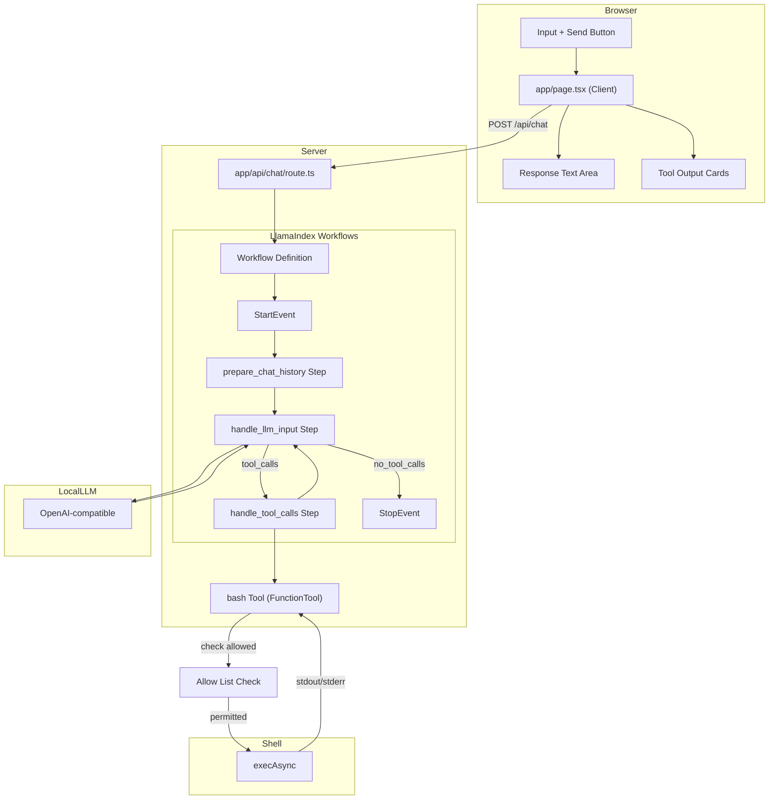

# Simple LLM Chat Interface

## Project Overview

A minimal chat interface that connects to a OpenAI-compatible LLM with bash execution capabilities. The app allows users to send prompts and receive responses, with the LLM able to invoke a `bash` tool to execute shell commands.

Built with LlamaIndex Workflows' event-driven, step-based paradigm — a `Workflow` is defined with typed `@step`-decorated functions that pass `Event` objects between each other. The workflow automatically routes events based on type annotations, enabling loops and conditional branching.

---

## Architecture

```
┌─────────────────────────────────────────────────────────────┐
│                    User Browser                              │
│                                                             │
│  ┌───────────────────────────────────────────────────────┐  │
│  │              app/page.tsx (Client)                    │  │
│  │  ┌─────────────┐       ┌──────────────┐              │  │
│  │  │   Input     │──────▶│   Response   │              │  │
│  │  │   Text +    │       │   Text Area  │              │  │
│  │  │   Button    │       └──────────────┘              │  │
│  │  └─────────────┘                                     │  │
│  │        │                                             │  │
│  │        │ fetch POST /api/chat                        │  │
│  │        ▼                                             │  │
│  └───────────────────────────────────────────────────────┘  │
└─────────────────────────────────────────────────────────────┘
                        │
                        │ HTTP POST
                        ▼
┌─────────────────────────────────────────────────────────────┐
│              app/api/chat/route.ts                          │
│                                                             │
│  ┌─────────────────┐    ┌───────────────────────────────┐   │
│  │ Workflow.run()  │───▶│ bash Tool (FunctionTool)     │   │
│  │                 │    │  - FunctionTool.from_defaults│   │
│  │                 │    │  - execAsync(cmd, timeout)   │   │
│  │  ┌────────────┐ │    │  - 30s timeout              │   │
│  │  │   prompt   │ │    │  - returns stdout/stderr     │   │
│  │  └────────────┘ │    └───────────────────────────────┘   │
│  │        │        │    ▲                            │      │
│  │        └─────────┼────────────────────────────┘         │
│  │            │       │                                     │
│  │            ▼       │                                     │
│  │  ┌──────────────┐  │                                     │
│  │  │  Return JSON │◀─┼─────────────────────────────────────┤
│  │  │  - response  │  │                                     │
│  │  │  - events────┘                                │      │
│  │  └──────────────┘                                   │      │
│  └─────────────────┘                                   │      │
│        │                                               │      │
└────────┼────────────────────────────────────────────────┘      │
         │                                                       │
         │ OpenAI-compatible API call                            │
         │ timeout: 120s                                         │
         │ Allow List Check                                      │
         │                                                       │
         ▼
┌────────────────────────────────────────────────────────────────────┐
│                    LLM via URL                                     │
└────────────────────────────────────────────────────────────────────┘
```

---

## Mermaid Architecture Diagram



---

## Technical Stack

| Layer | Technology | Version |
|-------|------------|---------|
| **Framework** | Next.js | 16.2.10 (App Router) |
| **UI** | React | 19.2.4 |
| **Workflow Framework** | LlamaIndex Workflows | 0.x (via llama-index-core) |
| **Validation** | Pydantic | 2.x |
| **Styling** | Tailwind CSS | v4 |
| **Type Safety** | TypeScript | 5.x |
| **Fonts** | Geist Sans/Mono | (via Tailwind v4) |

---

## Key Components

### `app/page.tsx`

**Type**: Client Component (`'use client'`)  
**Purpose**: Chat UI with input, response display, and tool output visualization

```tsx
useState hooks:
  - prompt: Input field value
  - response: LLM response text
  - toolOutputs: Array of bash tool execution results
  - loading: Button/input disabled state

send():
  - POST to /api/chat with { prompt }
  - Update response and toolOutputs on success
```

### `app/api/chat/route.ts`

**Type**: Server API Route (POST)  
**Purpose**: Orchestrate LLM inference via a LlamaIndex Workflow

```tsx
Key imports (Python):
  - Workflow, StartEvent, StopEvent, step, Context from llama_index.core.workflow
  - Event from llama_index.core.workflow
  - FunctionTool from llama_index.core.tools
  - ChatMemoryBuffer from llama_index.core.memory
  - BaseChatMessage, ChatMessage from llama_index.core.llms

Key exports:
  - POST(req: NextRequest)

Configuration:
  - llm: OpenAI-compatible via llama-index llm provider
  - tools: [FunctionTool.from_defaults(bash_func)]
  - workflow: ChatWorkflow with typed steps
  - timeout: 120s (max workflow runtime)
```

### `app/globals.css`

**Type**: Global Styles  
**Purpose**: Tailwind v4 setup with system theme detection

```css
Tailwind v4 syntax:
  @import "tailwindcss"
  @theme inline { ... }

Features:
  - System color scheme detection (light/dark)
  - CSS custom properties for theming
  - Geist font family configuration
```

---

## LLM Configuration

```python
from llama_index.llms.openai_compatible import OpenAICompatible

llm = OpenAICompatible(
    model="modelName",
    api_key="example",
    base_url="baseUrl",
)
```

| Setting | Value |
|---------|-------|
| **Model** | `modelName` |
| **Base URL** | `baseUrl` |
| **API Key** | `example` |
| **Provider Type** | OpenAI-compatible |
| **Max Tokens** | Model-dependent |

Configuration data is persisted to a file called llm-config.json

---

## Bash Tool Design

### Schema Definition

LlamaIndex wraps Python functions as tools using `FunctionTool.from_defaults()`. Type hints and docstrings are auto-converted into tool schemas.

```python
import json
import subprocess
from llama_index.core.tools import FunctionTool

ALLOW_LIST = {"ls", "pwd"}
ALLOW_ALL = False

def bash_command(command: str) -> str:
    """Execute a bash command on the server.
    
    You MUST provide a "command" parameter with the exact shell command to run.
    This is the ONLY way to run commands. For example: command="pwd", 
    command="ls -la", command="npm run build".
    
    Args:
        command: The bash/shell command to execute
        
    Returns:
        JSON string with stdout, stderr, and optional error
    """
    base_cmd = command.split()[0] if command.strip() else ""
    if base_cmd not in ALLOW_LIST and not ALLOW_ALL:
        return json.dumps({
            "error": f"Command '{base_cmd}' not allowed",
            "stdout": "",
            "stderr": ""
        })
    
    try:
        result = subprocess.run(
            command, shell=True, capture_output=True, text=True, timeout=30
        )
        return json.dumps({
            "stdout": result.stdout.strip(),
            "stderr": result.stderr.strip()
        })
    except subprocess.TimeoutExpired:
        return json.dumps({
            "error": "Command timed out (30s)",
            "stdout": "",
            "stderr": ""
        })
    except Exception as e:
        return json.dumps({
            "error": str(e),
            "stdout": "",
            "stderr": ""
        })

bash_tool = FunctionTool.from_defaults(bash_command)
```

### Execution Configuration

| Setting | Value |
|---------|-------|
| **Command Runner** | `subprocess.run()` (synchronous) |
| **Timeout** | 30,000 ms (30 seconds) |
| **Captured Output** | `stdout`, `stderr`, `error` |
| **Workflow Timeout** | 120,000 ms (120 seconds) |

### Allow List Filtering

The bash tool enforces an allow list that restricts which commands can be executed. Before running a command, the tool checks if the base command (first word) is in the allow list.

### Return Types

LlamaIndex `FunctionTool` results are captured as `ToolOutput` objects with a `.content` string:

```python
# Success (returned as string, wrapped in ToolOutput)
json.dumps({
    "stdout": str,    # Trimmed
    "stderr": str     # Trimmed
})

# Error (returned as string)
json.dumps({
    "error": str,     # Error message
    "stdout": str,    # Trimmed (may be partial)
    "stderr": str     # Trimmed
})
```

---

## Command Allow List

### Default Allow List

By default, the allow list includes:
- `ls` - List directory contents
- `pwd` - Print working directory

### User Editable

Users can modify the allow list through the web app UI:
- **Add commands**: Enter a new command to add it to the list
- **Remove commands**: Click the remove button next to any command

### Allow All Mode

A toggle setting enables "Allow All" mode:
- **Enabled**: The allow list is ignored; any command the LLM generates will execute
- **Disabled**: Only commands in the allow list are permitted

---

## Design Patterns

### 1. Client-Server Separation

- **Client** (`page.tsx`): UI-only, no API credentials
- **Server** (`api/chat/route.ts`): Holds API key, makes LLM calls
- **Benefit**: API key never exposed to browser

### 2. LlamaIndex Workflows Event-Driven Pattern

```python
from typing import Any, List, Union
from llama_index.core.workflow import (
    Workflow, StartEvent, StopEvent, step, Context, Event
)
from llama_index.core.llms import ChatMessage
from llama_index.core.tools import ToolSelection, ToolOutput
from llama_index.core.memory import ChatMemoryBuffer
from llama_index.core.tools.types import BaseTool

# Step 1: Define custom event types
class InputEvent(Event):
    """Event carrying chat history for LLM processing."""
    input: list[ChatMessage]

class StreamEvent(Event):
    """Event for streaming response deltas."""
    delta: str

class ToolCallEvent(Event):
    """Event carrying tool calls to be executed."""
    tool_calls: list[ToolSelection]


# Step 2: Define the workflow with typed steps
class ChatWorkflow(Workflow):
    def __init__(
        self,
        *args: Any,
        llm: Any = None,
        tools: List[BaseTool] = None,
        **kwargs: Any,
    ) -> None:
        super().__init__(*args, **kwargs)
        self.tools = tools or []
        self.llm = llm
        # Ensure the LLM supports function/tool calling
        assert hasattr(self.llm, "stream_chat_with_tools")

    @step
    async def prepare_chat_history(
        self, ctx: Context, ev: StartEvent
    ) -> InputEvent:
        """Entry point: initialize memory and build chat history."""
        # Initialize memory if not exists
        memory = await ctx.store.get("memory", default=None)
        if not memory:
            memory = ChatMemoryBuffer.from_defaults(llm=self.llm)
        
        # Add user input to memory
        user_msg = ChatMessage(role="user", content=ev.input)
        memory.put(user_msg)
        
        # Get chat history
        chat_history = memory.get()
        
        # Persist memory
        await ctx.store.set("memory", memory)
        
        return InputEvent(input=chat_history)

    @step
    async def handle_llm_input(
        self, ctx: Context, ev: InputEvent
    ) -> Union[ToolCallEvent, StopEvent]:
        """Call LLM with chat history + tools. Returns ToolCallEvent or StopEvent."""
        chat_history = ev.input
        
        # Stream the LLM response
        response_stream = await self.llm.stream_chat_with_tools(
            self.tools, chat_history=chat_history
        )
        
        final_response = None
        async for response in response_stream:
            final_response = response
            ctx.write_event_to_stream(StreamEvent(delta=response.delta or ""))
        
        # Save assistant response to memory
        memory = await ctx.store.get("memory")
        memory.put(final_response.message)
        await ctx.store.set("memory", memory)
        
        # Extract tool calls
        tool_calls = self.llm.get_tool_calls_from_response(
            final_response, error_on_no_tool_call=False
        )
        
        if not tool_calls:
            # No tool calls — workflow is done
            return StopEvent(result={"response": final_response.message.content})
        
        # Tool calls found — pass to tool handler
        return ToolCallEvent(tool_calls=tool_calls)

    @step
    async def handle_tool_calls(
        self, ctx: Context, ev: ToolCallEvent
    ) -> InputEvent:
        """Execute tool calls and return updated chat history."""
        tool_calls = ev.tool_calls
        tools_by_name = {tool.metadata.get_name(): tool for tool in self.tools}
        tool_msgs = []
        
        # Execute each tool call
        for tool_call in tool_calls:
            tool = tools_by_name.get(tool_call.tool_name)
            additional_kwargs = {
                "tool_call_id": tool_call.tool_id,
                "name": tool.metadata.get_name(),
            }
            
            if not tool:
                tool_msgs.append(
                    ChatMessage(
                        role="tool",
                        content=f"Tool {tool_call.tool_name} does not exist",
                        additional_kwargs=additional_kwargs,
                    )
                )
                continue
            
            try:
                tool_output = tool(**tool_call.tool_kwargs)
                tool_msgs.append(
                    ChatMessage(
                        role="tool",
                        content=tool_output.content,
                        additional_kwargs=additional_kwargs,
                    )
                )
            except Exception as e:
                tool_msgs.append(
                    ChatMessage(
                        role="tool",
                        content=f"Encountered error in tool call: {e}",
                        additional_kwargs=additional_kwargs,
                    )
                )
        
        # Update memory with tool results
        memory = await ctx.store.get("memory")
        for msg in tool_msgs:
            memory.put(msg)
        await ctx.store.set("memory", memory)
        
        # Return updated chat history to loop back to LLM
        chat_history = memory.get()
        return InputEvent(input=chat_history)


# Step 3: Run the workflow
workflow = ChatWorkflow(
    llm=llm,
    tools=[bash_tool],
    timeout=120,  # 120 second max runtime
    verbose=True,
)

# Run synchronously
result = await workflow.run(input=prompt)
final_text = result["response"]

# Run with persistent context (for multi-turn)
ctx = Context(workflow)
result = await workflow.run(input=prompt, ctx=ctx)
```

**Key LlamaIndex Workflows concepts used**:
- `Event` — typed data containers that flow between steps (extend `Event` base class)
- `@step` — decorator marking async functions as workflow steps
- `StartEvent` — built-in event to initiate the workflow (contains initial input)
- `StopEvent` — built-in event to terminate the workflow (contains final result)
- `Context` (`ctx`) — provides `ctx.store` for persistent state across steps
- `ctx.store.set()` / `ctx.store.get()` — key-value storage that persists across step invocations
- `ctx.write_event_to_stream()` — writes events to the SSE stream for client-side updates
- `handler.stream_events()` — async iterator yielding streamed events
- **Type-driven routing** — workflow routes events based on step type annotations (e.g., step returning `InputEvent` → next step accepting `InputEvent`)
- **Loops** — natural loops form when a step returns an event type that another step consumes (e.g., `ToolCallEvent → handle_tool_calls → InputEvent → handle_llm_input → ToolCallEvent`)
- **Conditional routing** — step returns different event types (`Union[ToolCallEvent, StopEvent]`), workflow routes accordingly
- `timeout=120` — max workflow runtime in seconds (prevents infinite loops)
- `verbose=True` — logs each step execution for debugging

### 3. Tool Output Visualization

```tsx
result["response"] + tool_outputs[]:
  ├─ stdout → Green-tinted card with dark terminal background
  ├─ stderr → Red-tinted card for error streams
  └─ error  → Inline error message (execution failed)
```

---

## Key Dependencies

```json
{
  "dependencies": {
    "llama-index-core": "^0.x",
    "llama-index-llms-openai-compatible": "^0.x",
    "next": "16.2.10",
    "react": "19.2.4",
    "react-dom": "19.2.4"
  },
  "devDependencies": {
    "@tailwindcss/postcss": "^4",
    "@types/node": "^20",
    "@types/react": "^19",
    "@types/react-dom": "^19",
    "eslint": "^9",
    "eslint-config-next": "16.2.10",
    "tailwindcss": "^4",
    "typescript": "^5"
  }
}
```

---

## Development Workflow

```bash
# Start development server
bun dev

# Build for production
bun build

# Run production server
bun start
```

Access at `http://localhost:3000`

---

## Data Flow Summary

1. **User** types prompt and clicks Send
2. **Client** sends `POST /api/chat` with `{ prompt }`
3. **API Route** creates a `ChatWorkflow` with LLM + bash tool + typed steps
4. **Workflow** starts with `StartEvent(input=prompt)` → `prepare_chat_history()` step
5. **prepare_chat_history** builds chat history and returns `InputEvent`
6. **InputEvent** triggers `handle_llm_input()` step → LLM call with tools
7. **LLM** processes chat history, may emit tool calls
8. **handle_llm_input** routes to `ToolCallEvent` (if tools) or `StopEvent` (if done)
9. **ToolCallEvent** triggers `handle_tool_calls()` step
10. **handle_tool_calls** executes `bash_tool()` via `FunctionTool` (30s timeout)
    - **Allow List Check** verifies the base command is permitted (or "Allow All" is enabled)
11. **Tool results** added to memory; `InputEvent` returned → loop back to step 6
12. **Workflow** terminates when `StopEvent` is emitted
13. **API Route** returns `{ text: result["response"], toolOutputs[] }`
14. **Client** displays response text and tool output cards

---

## Future Considerations

- **Streaming**: Use `handler.stream_events()` with SSE for real-time response streaming
- **Human-in-the-loop**: Pause at a step and resume via `WorkflowServer` + `WorkflowClient`
- **Persistence**: Save `Context` to database for cross-session conversation history
- **Parallel steps**: Use workflow parallelism for independent tool executions
- **Nested workflows**: Embed sub-workflows within parent workflows
- **Observability**: Add Llamatrace/OpenTelemetry tracing
- **WorkflowServer**: Deploy workflows as REST APIs via `WorkflowServer`
- **AgentWorkflow**: Use built-in `AgentWorkflow` for simpler agent setups
- **Multi-agent patterns**: Combine agents as tools via `AgentWorkflow`
- **Add request/response logging**
- **Configure environment variables for API credentials**
- **Add loading states for individual workflow steps**
- **Support streaming tool outputs via SSE**

---

## LlamaIndex Workflows vs Vercel AI SDK: Key Mapping

| Vercel AI SDK | LlamaIndex Workflows |
|---------------|---------------------|
| `generateText()` | `Workflow.run(input=prompt)` |
| `tool({ parameters, execute })` | `FunctionTool.from_defaults(func)` |
| `maxSteps: 5` | `timeout=120` (runtime limit) |
| Tool result as object | Tool result as `ToolOutput` (.content string) |
| Built-in streaming (`useChat`) | `handler.stream_events()` + `ctx.write_event_to_stream()` |
| Auto message history | Explicit `ChatMemoryBuffer` + `ctx.store` |
| Implicit tool routing | Typed event routing (`Union[ToolCallEvent, StopEvent]`) |
| `ai` package | `llama-index-core` (Workflows included) |
| Single function call | Multi-step event-driven workflow |

## LlamaIndex Workflows vs LangChain: Key Mapping

| LangChain (createReactAgent) | LlamaIndex Workflows |
|------------------------------|---------------------|
| `createReactAgent({ llm, tools })` | `ChatWorkflow(llm, tools, steps)` |
| `StateGraph` with nodes/edges | `@step` functions with typed events |
| `maxIterations: 5` | `timeout=120` (time-based, not count-based) |
| `MemorySaver` | `ctx.store` (built-in key-value) + `ChatMemoryBuffer` |
| `invoke()` | `run(input=...)` |
| `stream()` | `handler.stream_events()` |
| `HumanMessage`/`AIMessage` | `ChatMessage` objects |
| `thread_id` in configurable | `Context` object passed to `run()` |
| Explicit nodes/edges | Typed event routing |

## LlamaIndex Workflows vs CrewAI: Key Mapping

| CrewAI | LlamaIndex Workflows |
|--------|---------------------|
| `Crew.kickoff()` | `Workflow.run(input=...)` |
| `Agent` + `Task` + `Crew` | Single `Workflow` with typed steps |
| 3-layer abstraction | 1-layer: events + steps |
| `maxIter: 5` | `timeout=120` |
| Tool as class | `FunctionTool.from_defaults(func)` |
| Sequential process | Event-driven (loops, conditionals, parallel) |
| Role/goal/backstory | Step functions (no roles) |

## LlamaIndex Workflows vs Agno: Key Mapping

| Agno | LlamaIndex Workflows |
|------|---------------------|
| `Agent.run(user=prompt)` | `Workflow.run(input=prompt)` |
| Python function as tool | `FunctionTool.from_defaults(func)` |
| `tool_call_limit=5` | `timeout=120` |
| `RunOutput` | `dict` result from `StopEvent` |
| `stream=True` | `handler.stream_events()` |
| `session_id` | `Context` object |
| Automatic agent loop | Explicit step-by-step event routing |
| `Agent` (1 primitive) | `Workflow` + `Event` + `@step` (3 primitives) |
| `Team` / `Workflow` primitives | Nested workflows, parallel steps |

## LlamaIndex Workflows vs LangGraph: Key Mapping

| LangGraph | LlamaIndex Workflows |
|-----------|---------------------|
| `StateGraph().addNode().compile()` | `Workflow` with `@step` functions |
| `Annotation.Root` state | `Event` classes + `ctx.store` |
| `maxIter: 5` | `timeout=120` |
| `MemorySaver` | `ctx.store` (built-in) |
| `invoke()` | `run(input=...)` |
| `stream()` with `StreamMode` | `handler.stream_events()` |
| Conditional edges (`addConditionalEdges`) | `Union[EventA, EventB]` return type |
| `addEdge()` | Type-driven automatic routing |
| Human-in-the-loop (`interrupt`) | `WorkflowServer` + `WorkflowClient` |
| Python + JS support | Python-first |
