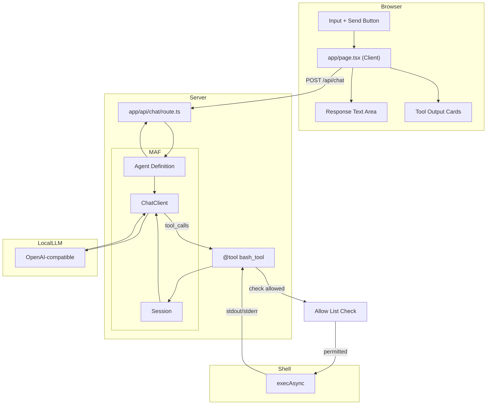

# Simple LLM Chat Interface

## Project Overview

A minimal chat interface that connects to a OpenAI-compatible LLM with bash execution capabilities. The app allows users to send prompts and receive responses, with the LLM able to invoke a `bash` tool to execute shell commands.

Built with Microsoft Agent Framework's agent-centric approach — an `Agent` is created from a chat client with tools, instructions, and session management. MAF provides production-grade features out of the box: compaction, observability, middleware, and multi-language support (Python, C#, Go).

---

## Architecture

```
┌─────────────────────────────────────────────────────────────┐
│                    User Browser                              │
│                                                             │
│  ┌───────────────────────────────────────────────────────┐  │
│  │              app/page.tsx (Client)                    │  │
│  │  ┌─────────────┐       ┌──────────────┐              │  │
│  │  │   Input     │──────▶│   Response   │              │  │
│  │  │   Text +    │       │   Text Area  │              │  │
│  │  │   Button    │       └──────────────┘              │  │
│  │  └─────────────┘                                     │  │
│  │        │                                             │  │
│  │        │ fetch POST /api/chat                        │  │
│  │        ▼                                             │  │
│  └───────────────────────────────────────────────────────┘  │
└─────────────────────────────────────────────────────────────┘
                        │
                        │ HTTP POST
                        ▼
┌─────────────────────────────────────────────────────────────┐
│              app/api/chat/route.ts                          │
│                                                             │
│  ┌─────────────────┐    ┌───────────────────────────────┐   │
│  │ Agent.run()     │───▶│ bash Tool (@tool decorated)  │   │
│  │                 │    │  - FunctionInvocationContext │   │
│  │                 │    │  - execAsync(cmd, timeout)   │   │
│  │  ┌────────────┐ │    │  - 30s timeout              │   │
│  │  │   prompt   │ │    │  - returns stdout/stderr     │   │
│  │  └────────────┘ │    └───────────────────────────────┘   │
│  │        │        │    ▲                            │      │
│  │        └─────────┼────────────────────────────┘         │
│  │            │       │                                     │
│  │            ▼       │                                     │
│  │  ┌──────────────┐  │                                     │
│  │  │  AgentResult │◀─┼─────────────────────────────────────┤
│  │  │  - text      │  │                                     │
│  │  │  - tool_calls────┘                                │      │
│  │  └──────────────┘                                   │      │
│  └─────────────────┘                                   │      │
│        │                                               │      │
└────────┼────────────────────────────────────────────────┘      │
         │                                                       │
         │ OpenAI-compatible API call                            │
         │ session-based state                                   │
         │ Allow List Check                                      │
         │                                                       │
         ▼
┌────────────────────────────────────────────────────────────────────┐
│                    LLM via URL                                     │
└────────────────────────────────────────────────────────────────────┘
```

---

## Mermaid Architecture Diagram



---

## Technical Stack

| Layer | Technology | Version |
|-------|------------|---------|
| **Framework** | Next.js | 16.2.10 (App Router) |
| **UI** | React | 19.2.4 |
| **Agent Framework** | Microsoft Agent Framework (Python) | 1.x |
| **Validation** | Pydantic | 2.x |
| **Styling** | Tailwind CSS | v4 |
| **Type Safety** | TypeScript | 5.x |
| **Fonts** | Geist Sans/Mono | (via Tailwind v4) |

---

## Key Components

### `app/page.tsx`

**Type**: Client Component (`'use client'`)  
**Purpose**: Chat UI with input, response display, and tool output visualization

```tsx
useState hooks:
  - prompt: Input field value
  - response: LLM response text
  - toolOutputs: Array of bash tool execution results
  - loading: Button/input disabled state

send():
  - POST to /api/chat with { prompt }
  - Update response and toolOutputs on success
```

### `app/api/chat/route.ts`

**Type**: Server API Route (POST)  
**Purpose**: Orchestrate LLM inference via a Microsoft Agent Framework agent

```tsx
Key imports (Python):
  - Agent, tool, FunctionInvocationContext from agent_framework
  - OpenAIChatClient from agent_framework.openai

Key exports:
  - POST(req: NextRequest)

Configuration:
  - client: OpenAIChatClient with openai-compatible baseURL
  - tools: [@tool decorated function]
  - agent: Agent with instructions, session management
  - run(): agent.run(prompt, session=session) → AgentResult
```

### `app/globals.css`

**Type**: Global Styles  
**Purpose**: Tailwind v4 setup with system theme detection

```css
Tailwind v4 syntax:
  @import "tailwindcss"
  @theme inline { ... }

Features:
  - System color scheme detection (light/dark)
  - CSS custom properties for theming
  - Geist font family configuration
```

---

## LLM Configuration

```python
from agent_framework.openai import OpenAIChatClient

client = OpenAIChatClient(
    model="modelName",
    base_url="baseUrl",
    api_key="example",
)
```

| Setting | Value |
|---------|-------|
| **Model** | `modelName` |
| **Base URL** | `baseUrl` |
| **API Key** | `example` |
| **Provider Type** | OpenAI-compatible |
| **Max Retries** | Client default |

Configuration data is persisted to a file called llm-config.json

---

## Bash Tool Design

### Schema Definition

MAF uses the `@tool` decorator to turn Python functions into agent-accessible tools. Type hints with `Annotated` and Pydantic's `Field` provide descriptions to the model.

```python
import json
import subprocess
from typing import Annotated
from pydantic import Field
from agent_framework import tool, FunctionInvocationContext

ALLOW_LIST = {"ls", "pwd"}
ALLOW_ALL = False

@tool(
    name="bash",
    description="""Execute a bash command on the server.
    You MUST provide a "command" parameter with the exact shell command to run.
    This is the ONLY way to run commands. For example: command="pwd", 
    command="ls -la", command="npm run build"."""
)
def bash_tool(
    command: Annotated[str, Field(description="The bash/shell command to execute")],
    ctx: FunctionInvocationContext,
) -> str:
    """Execute a bash command and return stdout/stderr.
    
    Args:
        command: The shell command to execute
        ctx: Runtime context (injected by MAF, not sent to model)
        
    Returns:
        JSON string with stdout, stderr, and optional error
    """
    base_cmd = command.split()[0] if command.strip() else ""
    if base_cmd not in ALLOW_LIST and not ALLOW_ALL:
        return json.dumps({
            "error": f"Command '{base_cmd}' not allowed",
            "stdout": "",
            "stderr": ""
        })
    
    try:
        result = subprocess.run(
            command, shell=True, capture_output=True, text=True, timeout=30
        )
        return json.dumps({
            "stdout": result.stdout.strip(),
            "stderr": result.stderr.strip()
        })
    except subprocess.TimeoutExpired:
        return json.dumps({
            "error": "Command timed out (30s)",
            "stdout": "",
            "stderr": ""
        })
    except Exception as e:
        return json.dumps({
            "error": str(e),
            "stdout": "",
            "stderr": ""
        })
```

### Execution Configuration

| Setting | Value |
|---------|-------|
| **Command Runner** | `subprocess.run()` (synchronous) |
| **Timeout** | 30,000 ms (30 seconds) |
| **Captured Output** | `stdout`, `stderr`, `error` |
| **Max Iterations** | Client/provider default (configurable per chat client) |

### Allow List Filtering

The bash tool enforces an allow list that restricts which commands can be executed. Before running a command, the tool checks if the base command (first word) is in the allow list.

### Return Types

MAF tool results are captured as strings in the agent's response:

```python
# Success (returned as string)
json.dumps({
    "stdout": str,    # Trimmed
    "stderr": str     # Trimmed
})

# Error (returned as string)
json.dumps({
    "error": str,     # Error message
    "stdout": str,    # Trimmed (may be partial)
    "stderr": str     # Trimmed
})
```

---

## Command Allow List

### Default Allow List

By default, the allow list includes:
- `ls` - List directory contents
- `pwd` - Print working directory

### User Editable

Users can modify the allow list through the web app UI:
- **Add commands**: Enter a new command to add it to the list
- **Remove commands**: Click the remove button next to any command

### Allow All Mode

A toggle setting enables "Allow All" mode:
- **Enabled**: The allow list is ignored; any command the LLM generates will execute
- **Disabled**: Only commands in the allow list are permitted

---

## Design Patterns

### 1. Client-Server Separation

- **Client** (`page.tsx`): UI-only, no API credentials
- **Server** (`api/chat/route.ts`): Holds API key, makes LLM calls
- **Benefit**: API key never exposed to browser

### 2. Microsoft Agent Framework Agent Pattern

```python
from agent_framework import Agent, tool, FunctionInvocationContext
from agent_framework.openai import OpenAIChatClient
from typing import Annotated
from pydantic import Field

# Step 1: Define the function tool
@tool(
    name="bash",
    description="Execute a bash command on the server."
)
def bash_tool(
    command: Annotated[str, Field(description="The bash/shell command to execute")],
    ctx: FunctionInvocationContext,
) -> str:
    """Execute a bash command and return stdout/stderr."""
    # ... implementation ...

# Step 2: Create the chat client
client = OpenAIChatClient(
    model="modelName",
    base_url="baseUrl",
    api_key="example",
)

# Step 3: Create the agent
agent = Agent(
    client=client,
    name="chat-agent",
    instructions=[
        "You are a helpful assistant that can execute bash commands on the server.",
        "Use the bash tool to run commands and return the results to the user.",
        "Always explain what you did after running commands.",
    ],
    tools=[bash_tool],
)

# Step 4: Create a session for multi-turn conversations
session = agent.create_session()

# Step 5: Run the agent
result = await agent.run(prompt, session=session)

# Step 6: Access results
final_text = result.text                    # Final text response
tool_calls = result.tool_calls              # List of tool calls made
tool_results = [tc.result for tc in tool_calls]  # Tool execution results
```

**Key Microsoft Agent Framework concepts used**:
- `Agent` — the core primitive; encapsulates client, tools, instructions, and session
- `tools=[bash_tool]` — Python functions decorated with `@tool` are auto-registered as tools
- `FunctionInvocationContext` (`ctx`) — special parameter auto-injected by MAF (not sent to model); provides `ctx.kwargs`, `ctx.session`, and methods like `ctx.add_tools()` / `ctx.remove_tools()`
- `agent.create_session()` — creates a session for multi-turn conversation history
- `agent.run(prompt, session=session)` — runs the agent; session persists context across calls
- `AgentResult` — contains `.text` (final response), `.tool_calls` (list of executed tools)
- `@tool(name=..., description=..., schema=...)` — decorator for explicit tool control; can accept Pydantic model or JSON schema dict
- `Annotated[str, Field(description="...")]` — type hints provide parameter descriptions to the model
- `FunctionTool(name=..., func=None, ...)` — declaration-only tools (schema sent to model, no local implementation)
- **Middleware/Filters** — intercept agent actions (pre/post hooks on tool calls)
- **Compaction** — built-in context-window compaction (via chat client options)
- **Observability** — built-in OpenTelemetry tracing
- **Tool approval** — approval-gated tool execution (for sensitive operations)
- **Background agents** — delegate parallel sub-tasks to sub-agents
- **Harness** — opinionated agent with batteries-included features (todo list, file memory, web search, mode switching)

### 3. Tool Output Visualization

```tsx
result.tool_calls[]:
  ├─ stdout → Green-tinted card with dark terminal background
  ├─ stderr → Red-tinted card for error streams
  └─ error  → Inline error message (execution failed)
```

---

## Key Dependencies

```json
{
  "dependencies": {
    "agent-framework": "^1.x",
    "agent-framework-openai": "^1.x",
    "next": "16.2.10",
    "react": "19.2.4",
    "react-dom": "19.2.4"
  },
  "devDependencies": {
    "@tailwindcss/postcss": "^4",
    "@types/node": "^20",
    "@types/react": "^19",
    "@types/react-dom": "^19",
    "eslint": "^9",
    "eslint-config-next": "16.2.10",
    "tailwindcss": "^4",
    "typescript": "^5"
  }
}
```

---

## Development Workflow

```bash
# Start development server
bun dev

# Build for production
bun build

# Run production server
bun start
```

Access at `http://localhost:3000`

---

## Data Flow Summary

1. **User** types prompt and clicks Send
2. **Client** sends `POST /api/chat` with `{ prompt }`
3. **API Route** creates an MAF `Agent` with chat client, bash tool, and instructions
4. **API Route** creates a `session` for conversation state
5. **Agent** calls `agent.run(prompt, session=session)`
6. **Agent** sends context + tool definitions to the LLM via the chat client
7. **LLM** processes prompt, may request tool calls
8. **MAF** validates arguments, executes `bash_tool()` (30s timeout)
   - **Allow List Check** verifies the base command is permitted (or "Allow All" is enabled)
9. **Tool results** added to session context; agent loop continues
10. **Agent** loops until LLM returns final response (no more tool calls)
11. **API Route** returns `{ text, toolOutputs[] }` extracted from `AgentResult`
12. **Client** displays response text and tool output cards

---

## UI Behavior

### Autoscroll Behavior
- Uses `useLayoutEffect` + `setTimeout(..., 0)` pattern to autoscroll chat to bottom
- Triggers on changes to `messages` array or `loading` state
- Scrolls by setting `container.scrollTop = scrollHeight`
- This is a hard jump (no smooth scrolling animation)
- Unconditionally scrolls user back to bottom even if they scrolled up mid-conversation
- No scroll preservation or intersection observer for smart scrolling

### Chat Container Styling
- `flex-1 min-h-0 overflow-y-auto px-8 py-6 pb-20 space-y-6`
- `overflow-y-auto` enables scrolling
- `pb-20` provides bottom padding so content isn't hidden behind the sticky input bar

### Input Bar Behavior
- `sticky bottom-0` keeps input bar fixed at bottom of chat card
- Has `data-input-bar` attribute

### Typing Indicator Animation
- Three dots with staggered `animate-bounce` (Tailwind CSS)
- Animation delays: 0ms, 150ms, 300ms

### Other UI Effects
- Dark mode toggle: `transition-colors` on button
- Input field: `transition-shadow` on focus
- Send button: `transition-all` + `active:scale-[0.98]` press feedback
- Send button disabled state: `disabled:opacity-40`

### Notes on Scrolling
- No `smooth` scrolling — hard jump via direct scrollTop assignment
- No scroll preservation — user is always scrolled to bottom on new messages
- No `scrollIntoView` with `behavior: 'smooth'`
- No intersection observer or smart scroll detection

---

## Future Considerations

- **Harness mode**: Use `create_harness_agent()` for batteries-included features (todo list, file memory, web search, mode switching, auto-approval)
- **Workflows**: Use MAF's `@workflow`/`@step` functional API or `WorkflowBuilder` for multi-step orchestration
- **Multi-agent**: Pass `background_agents` to harness for parallel delegation
- **Compaction**: Enable context-window compaction via chat client options
- **Tool approval**: Mark tools with `approval_mode="always"` for safety gates
- **Sessions**: Use `agent.create_session()` for multi-turn persistence
- **Middleware**: Add filters for pre/post tool call hooks
- **Observability**: Built-in OpenTelemetry tracing
- **Multi-language**: C# and Go SDKs available for the same patterns
- **Agent skills**: Discover and load skills from the file system
- **Looping**: Use `loop_should_continue` predicate for iterative workflows
- **Add request/response logging**
- **Configure environment variables for API credentials**
- **Add loading states for individual tool calls**
- **Support streaming tool outputs via SSE**

---

## Microsoft Agent Framework vs Vercel AI SDK: Key Mapping

| Vercel AI SDK | Microsoft Agent Framework |
|---------------|--------------------------|
| `generateText()` | `Agent.run(prompt, session=session)` |
| `tool({ parameters, execute })` | `@tool` decorated function |
| `maxSteps: 5` | Chat client max iterations (provider-dependent) |
| Tool result as object | Tool result as string (captured in `AgentResult`) |
| Built-in streaming (`useChat`) | Chat client streaming support |
| Auto message history | `session` object (explicit) |
| Implicit tool routing | Automatic in Agent loop |
| `ai` package | `agent-framework` + provider packages |
| TypeScript-first | Python, C#, Go (multi-language) |

## Microsoft Agent Framework vs LangChain: Key Mapping

| LangChain (createReactAgent) | Microsoft Agent Framework |
|------------------------------|--------------------------|
| `createReactAgent({ llm, tools })` | `Agent(client=client, tools=[func])` |
| `StateGraph` with nodes/edges | Implicit agent loop (Agent handles the loop) |
| `maxIterations: 5` | Provider max iterations |
| `MemorySaver` / `SqliteSaver` | `agent.create_session()` + chat client storage |
| `invoke()` | `run(prompt, session=session)` |
| `stream()` | Chat client streaming |
| Explicit message management | Session-based context |
| `thread_id` in configurable | `session` object |
| `class extends Tool` | `@tool` decorated function |

## Microsoft Agent Framework vs CrewAI: Key Mapping

| CrewAI | Microsoft Agent Framework |
|--------|--------------------------|
| `Crew.kickoff()` | `Agent.run(prompt, session=session)` |
| `new Agent({ role, goal, tools })` | `Agent(client=client, name=..., instructions=..., tools=[...])` |
| `new Task({ description, agent })` | `agent.run(prompt)` (prompt is inline) |
| `process: 'sequential'` | Single agent (Harness for multi-agent) |
| `maxIter: 5` | Provider max iterations |
| Tool as class | `@tool` decorated function |
| 3-layer: Agent → Task → Crew | 1-layer: Agent (Harness/Workflow primitives) |

## Microsoft Agent Framework vs Agno: Key Mapping

| Agno | Microsoft Agent Framework |
|------|--------------------------|
| `Agent.run(user=prompt)` | `Agent.run(prompt, session=session)` |
| Python function as tool | `@tool` decorated function |
| `tool_call_limit=5` | Provider max iterations |
| `RunOutput` | `AgentResult` |
| `stream=True` | Chat client streaming |
| `session_id` | `agent.create_session()` |
| Automatic agent loop | Automatic agent loop |
| `Agent` (1 primitive) | `Agent` (1 primitive) + `Harness` + `Workflow` |
| `Team` / `Workflow` primitives | `WorkflowBuilder` + `@workflow` API |
| Multi-language | Python, C#, Go |

## Microsoft Agent Framework vs LangGraph: Key Mapping

| LangGraph | Microsoft Agent Framework |
|-----------|--------------------------|
| `StateGraph().addNode().compile()` | `Agent()` — implicit loop |
| `Annotation.Root` state | `session` object |
| `maxIter: 5` | Provider max iterations |
| `MemorySaver` | `agent.create_session()` |
| `invoke()` | `run(prompt, session=session)` |
| `stream()` | Chat client streaming |
| Explicit nodes/edges | Implicit (or `WorkflowBuilder` for explicit) |
| `interrupt` (HITL) | `RequestInfoExecutor` / tool approval |
| Python + JS | Python, C#, Go |

## Microsoft Agent Framework vs LlamaIndex Workflows: Key Mapping

| LlamaIndex Workflows | Microsoft Agent Framework |
|---------------------|--------------------------|
| `Workflow.run(input=...)` | `Agent.run(prompt, session=session)` |
| `@step` functions with typed events | `@tool` functions + implicit routing |
| `Event` classes | `AgentResult` / `FunctionInvocationContext` |
| `ctx.store` | `session` object |
| `timeout=120` | Provider max iterations |
| `FunctionTool.from_defaults(func)` | `@tool` decorated function |
| Event-driven loops | Implicit agent loop |
| `Workflow` + `Event` + `@step` | `Agent` + `session` + `@tool` |
| Python-first | Python, C#, Go |
