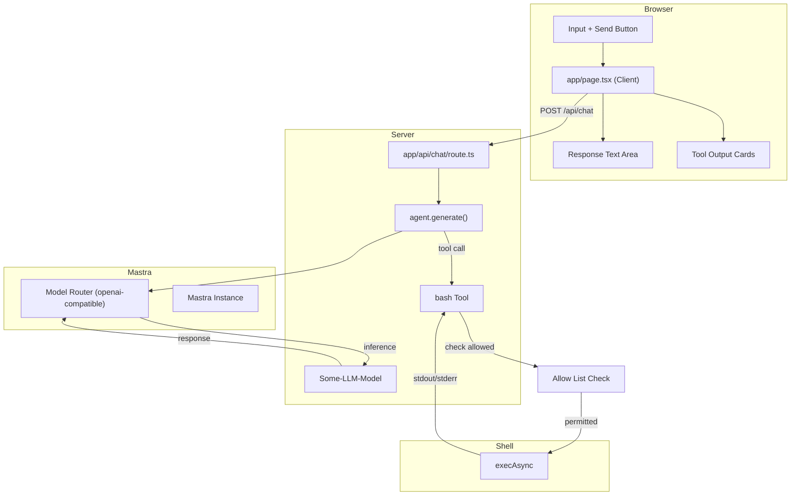

# Simple LLM Chat Interface

## Project Overview

A minimal chat interface that connects to a OpenAI-compatible LLM with bash execution capabilities using the Mastra framework. The app allows users to send prompts and receive responses, with the LLM able to invoke a `bash` tool to execute shell commands.

---

## Architecture

```
┌─────────────────────────────────────────────────────────────┐
│                    User Browser                              │
│                                                             │
│  ┌───────────────────────────────────────────────────────┐  │
│  │              app/page.tsx (Client)                    │  │
│  │  ┌─────────────┐       ┌──────────────┐              │  │
│  │  │   Input     │──────▶│   Response   │              │  │
│  │  │   Text +    │       │   Text Area  │              │  │
│  │  │   Button    │       └──────────────┘              │  │
│  │  └─────────────┘                                     │  │
│  │        │                                             │  │
│  │        │ fetch POST /api/chat                        │  │
│  │        ▼                                             │  │
│  └───────────────────────────────────────────────────────┘  │
└─────────────────────────────────────────────────────────────┘
                        │
                        │ HTTP POST
                        ▼
┌─────────────────────────────────────────────────────────────┐
│              app/api/chat/route.ts                          │
│                                                             │
│  ┌─────────────────┐    ┌───────────────────────────────┐   │
│  │ agent.generate()│───▶│ bash Tool (via Mastra)       │   │
│  │                 │    │  - Zod inputSchema           │   │
│  │  ┌────────────┐ │    │  - execAsync(cmd, timeout)   │   │
│  │  │   prompt   │ │    │  - 30s timeout              │   │
│  │  └────────────┘ │    │  - returns stdout/stderr     │   │
│  │        │        │    └───────────────────────────────┘   │
│  │        │           ▲                            │         │
│  │        └───────────┼────────────────────────────┘         │
│  │            │       │                                     │
│  │            ▼       │                                     │
│  │  ┌──────────────┐  │                                     │
│  │  │  Return JSON │◀─┼─────────────────────────────────────┤
│  │  │  - text      │  │                                     │
│  │  │  - toolCalls──┘                                │      │
│  │  └──────────────┘                                   │      │
│  └─────────────────┘                                   │      │
│        │                                               │      │
└────────┼────────────────────────────────────────────────┘      │
         │                                                       │
         │ OpenAI-compatible API call                            │
         │ maxSteps: 5                                           │
         │ Allow List Check                                      │
         │                                                       │
         ▼
┌────────────────────────────────────────────────────────────────────┐
│                    LLM via URL (Model Router)                      │
└────────────────────────────────────────────────────────────────────┘
```

---

## Mermaid Architecture Diagram



---

## Technical Stack

| Layer | Technology | Version |
|-------|------------|---------|
| **Framework** | Next.js | 16.2.10 (App Router) |
| **UI** | React | 19.2.4 |
| **Agent Framework** | @mastra/core | Latest |
| **Model Provider** | @ai-sdk/openai-compatible-v6 | (via Mastra Model Router) |
| **Validation** | Zod | 3.25.0 |
| **Styling** | Tailwind CSS | v4 |
| **Type Safety** | TypeScript | 5.x |
| **Fonts** | Geist Sans/Mono | (via Tailwind v4) |

---

## Key Components

### `app/page.tsx`

**Type**: Client Component (`'use client'`)  
**Purpose**: Chat UI with input, response display, and tool output visualization

```tsx
useState hooks:
  - prompt: Input field value
  - response: LLM response text
  - toolOutputs: Array of bash tool execution results
  - loading: Button/input disabled state

send():
  - POST to /api/chat with { prompt }
  - Update response and toolOutputs on success
```

### `app/api/chat/route.ts`

**Type**: Server API Route (POST)  
**Purpose**: Orchestrate LLM inference and tool execution via Mastra Agent

```tsx
Key exports:
  - POST(req: NextRequest)

Configuration:
  - Model: OpenAI-compatible via Mastra Model Router
    - Config: { id: "custom/model", url: baseURL, apiKey }
  - tools: { bash }
  - maxSteps: 5
```

### `mastra/agent.ts` (or inline agent)

**Purpose**: Define the Mastra Agent with model and tools

```ts
Agent config:
  - id: 'chat-agent'
  - name: 'Chat Agent'
  - instructions: 'You are a helpful assistant. Use the bash tool when necessary.'
  - model: openaiCompatible('modelName', { baseURL, apiKey })
  - tools: { bash: bashTool }
```

### `mastra/tools/bash.ts`

**Purpose**: Define the bash execution tool using Mastra's `createTool`

```ts
createTool({
  id: 'bash',
  description: 'Execute a bash command on the server.',
  inputSchema: z.object({
    command: z.string().describe('The bash/shell command to execute'),
  }),
  execute: async ({ command }) => { ... }
})
```

### `app/globals.css`

**Type**: Global Styles  
**Purpose**: Tailwind v4 setup with system theme detection

```css
Tailwind v4 syntax:
  @import "tailwindcss"
  @theme inline { ... }

Features:
  - System color scheme detection (light/dark)
  - CSS custom properties for theming
  - Geist font family configuration
```

---

## LLM Configuration

### Mastra Model Resolution

Mastra uses a Model Router that accepts OpenAI-compatible configuration via `OpenAICompatibleConfig`:

```ts
const model: MastraModelConfig = {
  id: 'provider-name/model-name',  // e.g., 'openai/gpt-4o' or 'custom/my-model'
  url: 'baseUrl',                   // OpenAI-compatible endpoint
  apiKey: 'apiKey',
};
```

Alternatively, a provider tool can be created directly:

```ts
import { createOpenAICompatible } from '@ai-sdk/openai-compatible-v6';

const provider = createOpenAICompatible({
  name: 'provider-name',
  baseURL: 'baseUrl',
  apiKey: 'example',
  supportsStructuredOutputs: true,
});

const model = provider.chatModel('modelName');
```

| Setting | Value |
|---------|-------|
| **Model** | `modelName` (via provider.chatModel) or `{ id, url, apiKey }` |
| **Base URL** | `baseUrl` (custom OpenAI-compatible endpoint) |
| **API Key** | `apiKey` (or falls back to env vars) |
| **Provider Type** | `@ai-sdk/openai-compatible-v6` (via Mastra Model Router) |
| **Max Retries** | `0` (no retries) |

Configuration data is persisted to a file called `config.json` (same format as vercel-ai).

---

## Bash Tool Design

### Schema Definition

```ts
import { createTool } from '@mastra/core/tools';
import { z } from 'zod';

const bashTool = createTool({
  id: 'bash',
  description: `Execute a bash command on the server. You MUST provide a "command" 
  parameter with the exact shell command to run. This is the ONLY way to run 
  commands. For example: command="pwd", command="ls -la", command="npm run build".`,
  
  inputSchema: z.object({
    command: z.string().describe('The bash/shell command to execute'),
  }),
  
  execute: async ({ command }, context) => { ... }
});
```

### Execution Configuration

| Setting | Value |
|---------|-------|
| **Command Runner** | `child_process.exec` (promisified) |
| **Timeout** | 30,000 ms (30 seconds) |
| **Captured Output** | `stdout`, `stderr`, `error` |
| **maxSteps** | 5 (multi-step reasoning) |

### Allow List Filtering

The bash tool enforces an allow list that restricts which commands can be executed. Before running a command, the tool checks if the base command (first word) is in the allow list.

### Return Types

```ts
// Success
{
  stdout: string,  // Trimmed
  stderr: string   // Trimmed
}

// Error
{
  error: string,   // Error message
  stdout: string,  // Trimmed (may be partial)
  stderr: string   // Trimmed
}
```

---

## Command Allow List

### Default Allow List

By default, the allow list includes:
- `ls` - List directory contents
- `pwd` - Print working directory

### User Editable

Users can modify the allow list through the web app UI:
- **Add commands**: Enter a new command to add it to the list
- **Remove commands**: Click the remove button next to any command

### Allow All Mode

A toggle setting enables "Allow All" mode:
- **Enabled**: The allow list is ignored; any command the LLM generates will execute
- **Disabled**: Only commands in the allow list are permitted

---

## Design Patterns

### 1. Client-Server Separation

- **Client** (`page.tsx`): UI-only, no API credentials
- **Server** (`api/chat/route.ts`): Holds API key, invokes Mastra Agent
- **Benefit**: API key never exposed to browser

### 2. Mastra Agent Tool Calling

```tsx
const agent = new Agent({
  id: 'chat-agent',
  name: 'Chat Agent',
  instructions: 'You are a helpful assistant...',
  model: myModel,  // OpenAI-compatible model
  tools: { bash: bashTool },
});

const result = await agent.generate(prompt, { maxSteps: 5 });
```

### 3. Tool Output Visualization

```tsx
result.toolResults[] (from Mastra FullOutput):
  ├─ stdout → Green-tinted card with dark terminal background
  ├─ stderr → Red-tinted card for error streams
  └─ error  → Inline error message (execution failed)
```

---

## Key Dependencies

```json
{
  "dependencies": {
    "@mastra/core": "latest",
    "@ai-sdk/openai-compatible-v6": "latest",
    "ai": "^7.0.34",
    "zod": "^3.25.0",
    "next": "16.2.10",
    "react": "19.2.4",
    "react-dom": "19.2.4"
  },
  "devDependencies": {
    "@tailwindcss/postcss": "^4",
    "@types/node": "^20",
    "@types/react": "^19",
    "@types/react-dom": "^19",
    "eslint": "^9",
    "eslint-config-next": "16.2.10",
    "tailwindcss": "^4",
    "typescript": "^5"
  }
}
```

---

## Development Workflow

```bash
# Start development server
bun dev

# Build for production
bun build

# Run production server
bun start
```

Access at `http://localhost:3000`

---

## Data Flow Summary

1. **User** types prompt and clicks Send
2. **Client** sends `POST /api/chat` with `{ prompt }`
3. **API Route** creates/gets Mastra Agent and calls `agent.generate(prompt, { maxSteps: 5 })`
4. **Agent** processes prompt, may call bash tool (up to 5 steps)
5. **Bash Tool** executes command via `execAsync()` (30s timeout)
   - **Allow List Check** verifies the base command is permitted (or "Allow All" is enabled)
6. **Agent** returns `FullOutput` with `text` and `toolResults[]`
7. **API Route** returns `{ text, toolOutputs[] }`
8. **Client** displays response text and tool output cards

---

## Mastra-Specific Differences from Vercel AI SDK

| Aspect | Vercel AI SDK | Mastra |
|--------|---------------|--------|
| **Tool Definition** | `tool()` from `ai` | `createTool()` from `@mastra/core/tools` |
| **Tool Schema** | `parameters: z.object(...)` | `inputSchema: z.object(...)` |
| **Tool Execution** | `execute: async ({ command }) =>` | `execute: async ({ command }, context) =>` |
| **Model Config** | `createOpenAICompatible()('model', {})` | `{ id: 'provider/model', url, apiKey }` or `provider.chatModel('model')` |
| **Agent Invocation** | `generateText({ model, prompt, tools, maxSteps })` | `agent.generate(messages, { maxSteps })` |
| **Result Structure** | `result.text`, `result.steps[]` | `result.text`, `result.toolResults[]` |
| **Multiple Tool Schemas** | Vercel SDK v3/v4/v5 schemas via `parameters` | Mastra uses StandardSchema (Zod v4) via `inputSchema`; also supports Vercel `tool()` helper |
| **Agent Lifecycle** | Stateless per-call | Agent instance with optional memory, signals, workflows |
| **Max Steps** | `maxSteps: 5` in `generateText()` | `maxSteps: 5` in `agent.generate()` options |
| **LLM Calls** | Direct to provider | Via Mastra Model Router (supports 40+ providers) |

### Agent Generation Result

```ts
const result = await agent.generate(prompt, { maxSteps: 5 });

// result (FullOutput):
//   .text         → Final assistant text response
//   .toolResults  → Array of { toolName, toolCallId, args, result, isError }
//   .steps        → Execution steps with reasoning, tool calls
//   .usage        → Token usage statistics
```

---

## UI Behavior

### Autoscroll Behavior

- Uses `useLayoutEffect` + `setTimeout(..., 0)` pattern to autoscroll chat to bottom
- Triggers on changes to `messages` array or `loading` state (dependency: `[messages, loading]`)
- Scrolls by directly setting `container.scrollTop = container.scrollHeight`
- This is a **hard jump** — no smooth scrolling animation
- **Unconditionally** scrolls user back to bottom even if they scrolled up mid-conversation
- No scroll preservation or intersection observer for smart scrolling

```tsx
useLayoutEffect(() => {
  setTimeout(() => {
    const container = chatRef.current;
    if (container) {
      container.scrollTop = container.scrollHeight;
    }
  }, 0);
}, [messages, loading]);
```

### Chat Container Styling

- Class: `flex-1 min-h-0 overflow-y-auto px-8 py-6 pb-20 space-y-6`
- `flex-1 min-h-0` — flex growth with proper shrink behavior in parent flex column
- `overflow-y-auto` — enables vertical scrolling
- `px-8 py-6` — padding around message content
- `pb-20` — bottom padding so content isn't hidden behind the sticky input bar
- `space-y-6` — vertical spacing between message blocks

### Input Bar Behavior

- `sticky bottom-0` keeps input bar fixed at bottom of chat card
- Positioned with `border-t`, `bg`, and padding for visual separation
- Has `data-input-bar` attribute (useful for testing/selector targeting)
- Always visible above the footer, overlaying chat content at the bottom

### Typing Indicator Animation

Three dots with staggered `animate-bounce` from Tailwind CSS:
- Animation delays: **0ms**, **150ms**, **300ms** (via inline `style` prop)
- Dot size: `w-2 h-2 rounded-full`
- Color varies by theme: `bg-zinc-500` (dark) / `bg-zinc-400` (light)

```tsx
function TypingIndicator({ dark }: { dark: boolean }) {
  const dotColor = dark ? 'bg-zinc-500' : 'bg-zinc-400';
  return (
    <div className="flex items-center gap-1">
      <span className={`w-2 h-2 rounded-full ${dotColor} animate-bounce`} style={{ animationDelay: '0ms' }} />
      <span className={`w-2 h-2 rounded-full ${dotColor} animate-bounce`} style={{ animationDelay: '150ms' }} />
      <span className={`w-2 h-2 rounded-full ${dotColor} animate-bounce`} style={{ animationDelay: '300ms' }} />
    </div>
  );
}
```

### Other UI Effects

| Element | Transition / Effect |
|---------|---------------------|
| Dark mode toggle button | `transition-colors` on button |
| Input textarea | `transition-shadow` on focus (ring animation) |
| Send button | `transition-all` + `active:scale-[0.98]` press feedback |
| Send button (disabled) | `disabled:opacity-40 disabled:cursor-not-allowed` |

---

## Notes on Scrolling

- **No smooth scrolling** — hard jump via direct `scrollTop` assignment
- **No scroll preservation** — user is always scrolled to bottom on new messages
- **No `scrollIntoView`** with `behavior: 'smooth'`
- **No intersection observer** or smart scroll detection
- The `useLayoutEffect` + `setTimeout(..., 0)` pattern is used to defer the scroll to the next paint after React has committed the DOM updates
- Test files exist (`test-scroll.mjs`, `test-scroll2.mjs`) suggesting scroll behavior was previously tested/investigated

---

## Future Considerations

- Allow list enhancements: wildcard patterns (`ls*`), regex matching, per-session settings, shared team defaults
- Add streaming responses via `agent.stream()` with `onChunk` callback
- Support multi-turn conversation history with Mastra Memory
- Add request/response logging
- Configure environment variables for API credentials
- Add loading states for individual tool calls
- Support streaming tool outputs
- Add observability/tracing via Mastra Observability
- Leverage Mastra's MCP server capabilities for tool exposure
