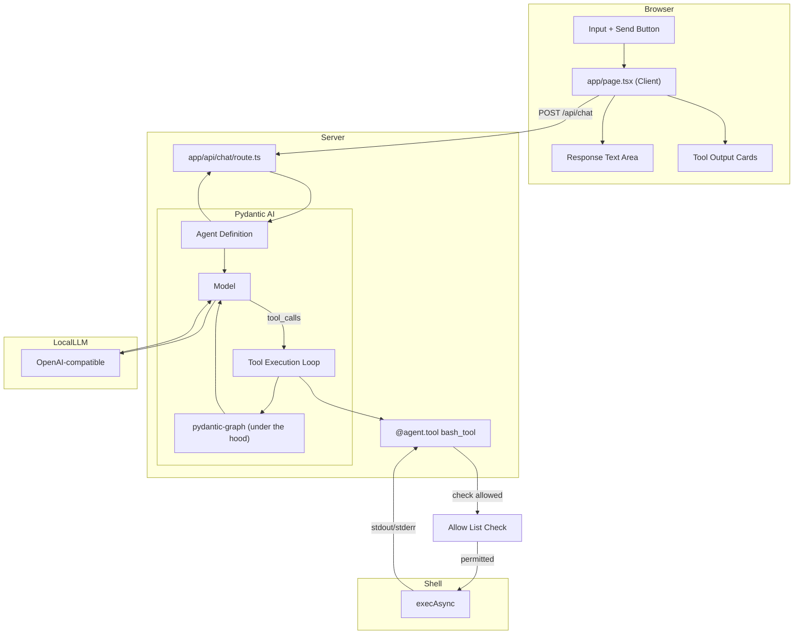

# Simple LLM Chat Interface

## Project Overview

A minimal chat interface that connects to a OpenAI-compatible LLM with bash execution capabilities. The app allows users to send prompts and receive responses, with the LLM able to invoke a `bash` tool to execute shell commands.

Built with Pydantic AI's type-safe approach — an `Agent` is defined with a model ID, dependency type, output type, and tools. Tools are registered via `@agent.tool` (with context) or `@agent.tool_plain` (pure functions). Pydantic AI uses **pydantic-graph** under the hood for execution flow, but the API is minimal: just `agent.run()`.

---

## Architecture

```
┌─────────────────────────────────────────────────────────────┐
│                    User Browser                              │
│                                                             │
│  ┌───────────────────────────────────────────────────────┐  │
│  │              app/page.tsx (Client)                    │  │
│  │  ┌─────────────┐       ┌──────────────┐              │  │
│  │  │   Input     │──────▶│   Response   │              │  │
│  │  │   Text +    │       │   Text Area  │              │  │
│  │  │   Button    │       └──────────────┘              │  │
│  │  └─────────────┘                                     │  │
│  │        │                                             │  │
│  │        │ fetch POST /api/chat                        │  │
│  │        ▼                                             │  │
│  └───────────────────────────────────────────────────────┘  │
└─────────────────────────────────────────────────────────────┘
                        │
                        │ HTTP POST
                        ▼
┌─────────────────────────────────────────────────────────────┐
│              app/api/chat/route.ts                          │
│                                                             │
│  ┌─────────────────┐    ┌───────────────────────────────┐   │
│  │ Agent.run()     │───▶│ bash Tool (@agent.tool)      │   │
│  │                 │    │  - RunContext                │   │
│  │                 │    │  - execAsync(cmd, timeout)   │   │
│  │  ┌────────────┐ │    │  - 30s timeout              │   │
│  │  │   prompt   │ │    │  - returns stdout/stderr     │   │
│  │  └────────────┘ │    └───────────────────────────────┘   │
│  │        │        │    ▲                            │      │
│  │        └─────────┼────────────────────────────┘         │
│  │            │       │                                     │
│  │            ▼       │                                     │
│  │  ┌──────────────┐  │                                     │
│  │  │  RunResult   │◀─┼─────────────────────────────────────┤
│  │  │  - output    │  │                                     │
│  │  │  - tool_calls────┘                                │      │
│  │  └──────────────┘                                   │      │
│  └─────────────────┘                                   │      │
│        │                                               │      │
└────────┼────────────────────────────────────────────────┘      │
         │                                                       │
         │ OpenAI-compatible API call                            │
         │ model ID: "openai-compatible:model_name"              │
         │ max tool calls: 5 (UsageLimits)                       │
         │ Allow List Check                                      │
         │                                                       │
         ▼
┌────────────────────────────────────────────────────────────────────┐
│                    LLM via URL                                     │
└────────────────────────────────────────────────────────────────────┘
```

---

## Mermaid Architecture Diagram



---

## Technical Stack

| Layer | Technology | Version |
|-------|------------|---------|
| **Framework** | Next.js | 16.2.10 (App Router) |
| **UI** | React | 19.2.4 |
| **Agent Framework** | Pydantic AI | 2025.x |
| **Graph Engine** | pydantic-graph | (bundled) |
| **Validation** | Pydantic | 2.x |
| **Styling** | Tailwind CSS | v4 |
| **Type Safety** | TypeScript | 5.x |
| **Fonts** | Geist Sans/Mono | (via Tailwind v4) |

---

## Key Components

### `app/page.tsx`

**Type**: Client Component (`'use client'`)  
**Purpose**: Chat UI with input, response display, and tool output visualization

```tsx
useState hooks:
  - prompt: Input field value
  - response: LLM response text
  - toolOutputs: Array of bash tool execution results
  - loading: Button/input disabled state

send():
  - POST to /api/chat with { prompt }
  - Update response and toolOutputs on success
```

### `app/api/chat/route.ts`

**Type**: Server API Route (POST)  
**Purpose**: Orchestrate LLM inference via a Pydantic AI agent

```tsx
Key imports (Python):
  - Agent, RunContext, UsageLimits from pydantic_ai
  - ChatOpenAIModel from pydantic_ai.providers.openai

Key exports:
  - POST(req: NextRequest)

Configuration:
  - model: ChatOpenAIModel with openai-compatible baseURL
  - tools: [@agent.tool decorated function]
  - agent: Agent with deps_type, system_prompt
  - usage_limits: UsageLimits(tool_call_limit=5)
  - run(): agent.run(prompt, deps=deps) → RunResult
```

### `app/globals.css`

**Type**: Global Styles  
**Purpose**: Tailwind v4 setup with system theme detection

```css
Tailwind v4 syntax:
  @import "tailwindcss"
  @theme inline { ... }

Features:
  - System color scheme detection (light/dark)
  - CSS custom properties for theming
  - Geist font family configuration
```

---

## LLM Configuration

```python
from pydantic_ai.providers.openai import ChatOpenAIModel

model = ChatOpenAIModel(
    model_id='modelName',
    base_url='baseUrl',
    api_key='example',
)
```

| Setting | Value |
|---------|-------|
| **Model ID** | `modelName` |
| **Base URL** | `baseUrl` |
| **API Key** | `example` |
| **Provider Type** | OpenAI-compatible |
| **Max Retries** | Provider default |

Configuration data is persisted to a file called llm-config.json

---

## Bash Tool Design

### Schema Definition

Pydantic AI uses decorators to register tools. `@agent.tool` takes a `RunContext` as first argument (for dependency injection); `@agent.tool_plain` is a pure function. Type hints auto-generate the JSON schema.

```python
import json
import subprocess
from pydantic_ai import Agent, RunContext

# Define dependencies (can be any type)
class ChatDeps:
    """Dependencies for the chat agent."""
    allow_list: set[str]
    allow_all: bool
    
    def __init__(self, allow_list: set[str] | None = None, allow_all: bool = False):
        self.allow_list = allow_list or {"ls", "pwd"}
        self.allow_all = allow_all

# Define the agent
agent = Agent(
    model,
    deps_type=ChatDeps,
    system_prompt=(
        "You are a helpful assistant that can execute bash commands on the server. "
        "Use the bash tool to run commands and return the results to the user. "
        "Always explain what you did after running commands."
    ),
)

@agent.tool
async def bash_tool(
    ctx: RunContext[ChatDeps],
    command: str,
) -> str:
    """Execute a bash command on the server.
    
    You MUST provide a "command" parameter with the exact shell command to run.
    This is the ONLY way to run commands. For example: command="pwd", 
    command="ls -la", command="npm run build".
    
    Args:
        command: The bash/shell command to execute
        ctx: Runtime context with access to dependencies (injected by Pydantic AI)
        
    Returns:
        JSON string with stdout, stderr, and optional error
    """
    base_cmd = command.split()[0] if command.strip() else ""
    if base_cmd not in ctx.deps.allow_list and not ctx.deps.allow_all:
        return json.dumps({
            "error": f"Command '{base_cmd}' not allowed",
            "stdout": "",
            "stderr": ""
        })
    
    try:
        result = subprocess.run(
            command, shell=True, capture_output=True, text=True, timeout=30
        )
        return json.dumps({
            "stdout": result.stdout.strip(),
            "stderr": result.stderr.strip()
        })
    except subprocess.TimeoutExpired:
        return json.dumps({
            "error": "Command timed out (30s)",
            "stdout": "",
            "stderr": ""
        })
    except Exception as e:
        return json.dumps({
            "error": str(e),
            "stdout": "",
            "stderr": ""
        })
```

### Execution Configuration

| Setting | Value |
|---------|-------|
| **Command Runner** | `subprocess.run()` (synchronous) |
| **Timeout** | 30,000 ms (30 seconds) |
| **Captured Output** | `stdout`, `stderr`, `error` |
| **Max Tool Calls** | 5 (via `UsageLimits`) |

### Allow List Filtering

The bash tool enforces an allow list that restricts which commands can be executed. Before running a command, the tool checks if the base command (first word) is in the allow list. The allow list is passed via the `ChatDeps` dependency type.

### Return Types

Pydantic AI tool results are captured as strings in the agent's response:

```python
# Success (returned as string)
json.dumps({
    "stdout": str,    # Trimmed
    "stderr": str     # Trimmed
})

# Error (returned as string)
json.dumps({
    "error": str,     # Error message
    "stdout": str,    # Trimmed (may be partial)
    "stderr": str     # Trimmed
})
```

---

## Command Allow List

### Default Allow List

By default, the allow list includes:
- `ls` - List directory contents
- `pwd` - Print working directory

### User Editable

Users can modify the allow list through the web app UI:
- **Add commands**: Enter a new command to add it to the list
- **Remove commands**: Click the remove button next to any command

### Allow All Mode

A toggle setting enables "Allow All" mode:
- **Enabled**: The allow list is ignored; any command the LLM generates will execute
- **Disabled**: Only commands in the allow list are permitted

---

## Design Patterns

### 1. Client-Server Separation

- **Client** (`page.tsx`): UI-only, no API credentials
- **Server** (`api/chat/route.ts`): Holds API key, makes LLM calls
- **Benefit**: API key never exposed to browser

### 2. Pydantic AI Type-Safe Agent Pattern

```python
from pydantic_ai import Agent, RunContext, UsageLimits
from pydantic_ai.providers.openai import ChatOpenAIModel

# Step 1: Define the model
model = ChatOpenAIModel(
    model_id='modelName',
    base_url='baseUrl',
    api_key='example',
)

# Step 2: Define the dependency type
class ChatDeps:
    """Dependencies for the chat agent."""
    def __init__(self, allow_list: set[str] | None = None, allow_all: bool = False):
        self.allow_list = allow_list or {"ls", "pwd"}
        self.allow_all = allow_all

# Step 3: Create the agent with type parameters
agent = Agent[ChatDeps, str](  # Agent[deps_type, output_type]
    model,
    deps_type=ChatDeps,
    system_prompt=(
        "You are a helpful assistant that can execute bash commands on the server. "
        "Use the bash tool to run commands and return the results to the user."
    ),
)

# Step 4: Register the tool
@agent.tool
async def bash_tool(
    ctx: RunContext[ChatDeps],
    command: str,
) -> str:
    """Execute a bash command on the server.
    
    Args:
        command: The bash/shell command to execute
    """
    # ... implementation ...

# Step 5: Create dependencies
deps = ChatDeps(allow_list={"ls", "pwd"}, allow_all=False)

# Step 6: Run the agent
result = await agent.run(
    prompt,
    deps=deps,
    usage_limits=UsageLimits(tool_call_limit=5),
)

# Step 7: Access results
final_output = result.output           # Final text response (type: str)
tool_calls = result.all_messages()     # Full message history
# result.usage contains token usage stats
```

**Key Pydantic AI concepts used**:
- `Agent[DepT, OutputT]` — generic in dependency type and output type (defaults to `Agent[object, str]`)
- `deps_type=ChatDeps` — declares what dependency type this agent expects
- `output_type=str` — declares the output type (can be a Pydantic model for structured output)
- `@agent.tool` — registers an async function as a tool; first arg is `RunContext[DepT]`, rest are tool parameters
- `@agent.tool_plain` — registers a pure function as a tool (no context/dependencies)
- `RunContext[ChatDeps]` — parameterized with the dependency type; provides `ctx.deps` access
- `agent.run(prompt, deps=deps, usage_limits=...)` — async execution returns `AgentRunResult`
- `agent.run_sync(prompt, deps=deps)` — synchronous execution (same return type)
- `agent.run_stream(prompt, deps=deps)` — async streaming (returns `StreamedRunResult`)
- `agent.run_stream_events(prompt, deps=deps)` — stream all events (returns iterator over `AgentStreamEvent`)
- `agent.iter(prompt, deps=deps)` — iterate over underlying graph nodes (`UserPromptNode`, `ModelRequestNode`, `CallToolsNode`, `End`)
- `AgentRunResult` — contains `.output` (validated output), `.all_messages()` (message history), `.usage` (token stats)
- `UsageLimits` — set limits on `output_tokens_limit`, `requests`, and `tool_call_limit`
- `end_strategy='graceful'` or `'exhaustive'` — control behavior when text and tool calls coexist
- **pydantic-graph** — under the hood, each agent uses a typed finite state machine (`UserPromptNode → ModelRequestNode → CallToolsNode → End`)
- **Structured output** — set `output_type=MyPydanticModel` for type-safe structured responses
- **Capabilities** — reusable bundles of tools, hooks, instructions, and model settings
- **Model retry** — raise `ModelRetry` in a tool to request the model retry

### 3. Tool Output Visualization

```tsx
result.all_messages():
  ├─ stdout → Green-tinted card with dark terminal background
  ├─ stderr → Red-tinted card for error streams
  └─ error  → Inline error message (execution failed)
```

---

## Key Dependencies

```json
{
  "dependencies": {
    "pydantic-ai": "^2025.x",
    "pydantic": "^2.x",
    "next": "16.2.10",
    "react": "19.2.4",
    "react-dom": "19.2.4"
  },
  "devDependencies": {
    "@tailwindcss/postcss": "^4",
    "@types/node": "^20",
    "@types/react": "^19",
    "@types/react-dom": "^19",
    "eslint": "^9",
    "eslint-config-next": "16.2.10",
    "tailwindcss": "^4",
    "typescript": "^5"
  }
}
```

---

## Development Workflow

```bash
# Start development server
bun dev

# Build for production
bun build

# Run production server
bun start
```

Access at `http://localhost:3000`

---

## Data Flow Summary

1. **User** types prompt and clicks Send
2. **Client** sends `POST /api/chat` with `{ prompt }`
3. **API Route** creates a Pydantic AI `Agent[ChatDeps, str]` with model, bash tool, and system prompt
4. **API Route** creates `ChatDeps` instance with allow list configuration
5. **Agent** calls `agent.run(prompt, deps=deps, usage_limits=UsageLimits(tool_call_limit=5))`
6. **pydantic-graph** traverses: `UserPromptNode → ModelRequestNode → CallToolsNode → ... → End`
7. **LLM** processes prompt, may request tool calls
8. **Pydantic AI** validates arguments (via type hints), executes `bash_tool()` (30s timeout)
   - **Allow List Check** verifies the base command is permitted (via `ctx.deps.allow_list`)
9. **Tool results** added to message history; graph loop continues
10. **Agent** loops until LLM returns final response (no more tool calls, or `tool_call_limit` reached)
11. **Pydantic** validates output against `output_type=str`
12. **API Route** returns `{ text, toolOutputs[] }` extracted from `AgentRunResult`
13. **Client** displays response text and tool output cards

---

## UI Behavior

### Autoscroll Behavior
- Uses `useLayoutEffect` + `setTimeout(..., 0)` pattern to autoscroll chat to bottom
- Triggers on changes to `messages` array or `loading` state
- Scrolls by setting `container.scrollTop = scrollHeight`
- This is a hard jump (no smooth scrolling animation)
- Unconditionally scrolls user back to bottom even if they scrolled up mid-conversation
- No scroll preservation or intersection observer for smart scrolling

### Chat Container Styling
- `flex-1 min-h-0 overflow-y-auto px-8 py-6 pb-20 space-y-6`
- `overflow-y-auto` enables scrolling
- `pb-20` provides bottom padding so content isn't hidden behind the sticky input bar

### Input Bar Behavior
- `sticky bottom-0` keeps input bar fixed at bottom of chat card
- Has `data-input-bar` attribute

### Typing Indicator Animation
- Three dots with staggered `animate-bounce` (Tailwind CSS)
- Animation delays: 0ms, 150ms, 300ms

### Other UI Effects
- Dark mode toggle: `transition-colors` on button
- Input field: `transition-shadow` on focus
- Send button: `transition-all` + `active:scale-[0.98]` press feedback
- Send button disabled state: `disabled:opacity-40`

### Notes on Scrolling
- No `smooth` scrolling — hard jump via direct scrollTop assignment
- No scroll preservation — user is always scrolled to bottom on new messages
- No `scrollIntoView` with `behavior: 'smooth'`
- No intersection observer or smart scroll detection

---

## Future Considerations

- **Structured output**: Set `output_type=MyResponseModel` (Pydantic model) for type-safe structured responses
- **Streaming**: Use `agent.run_stream()` + `async for text in response.stream_text()` for SSE streaming
- **Event streaming**: Use `agent.run_stream_events()` for detailed event inspection
- **Node iteration**: Use `agent.iter()` for step-by-step graph traversal
- **Usage limits**: Set `tool_call_limit`, `output_tokens_limit`, `requests` via `UsageLimits`
- **Capabilities**: Bundle tools, hooks, instructions into reusable `Capability` objects
- **Model retry**: Raise `ModelRetry()` in a tool to ask the LLM to retry
- **Dependencies**: Pass complex dependency objects (services, configs) via `deps_type`
- **Multi-agent**: Compose multiple agents (each with own deps/output types)
- **Add request/response logging**
- **Configure environment variables for API credentials**
- **Add loading states for individual tool calls**
- **Support streaming tool outputs via SSE**

---

## Pydantic AI vs Vercel AI SDK: Key Mapping

| Vercel AI SDK | Pydantic AI |
|---------------|-------------|
| `generateText()` | `Agent.run(prompt, deps=deps)` |
| `tool({ parameters, execute })` | `@agent.tool` decorated function |
| `maxSteps: 5` | `UsageLimits(tool_call_limit=5)` |
| Tool result as object | Tool result as string |
| Built-in streaming (`useChat`) | `agent.run_stream()` + `stream_text()` |
| Auto message history | `result.all_messages()` (explicit) |
| Implicit tool routing | Automatic in agent loop |
| `ai` package | `pydantic-ai` (minimal dependencies) |
| TypeScript-first | Python-first |

## Pydantic AI vs LangChain: Key Mapping

| LangChain (createReactAgent) | Pydantic AI |
|------------------------------|-------------|
| `createReactAgent({ llm, tools })` | `Agent(model, deps_type=T, tools=[...])` |
| `StateGraph` with nodes/edges | Implicit agent loop (pydantic-graph under the hood) |
| `maxIterations: 5` | `UsageLimits(tool_call_limit=5)` |
| `MemorySaver` / `SqliteSaver` | Not built-in (session management) |
| `invoke()` | `run(prompt, deps=deps)` |
| `stream()` | `run_stream()` / `run_stream_events()` |
| Explicit message management | `result.all_messages()` |
| `thread_id` in configurable | Not built-in |
| `class extends Tool` | `@agent.tool` decorated function |
| Type safety | Full type safety via `Agent[DepT, OutputT]` |

## Pydantic AI vs CrewAI: Key Mapping

| CrewAI | Pydantic AI |
|--------|-------------|
| `Crew.kickoff()` | `Agent.run(prompt, deps=deps)` |
| `new Agent({ role, goal, tools })` | `Agent(model, deps_type=T, system_prompt=...)` |
| `new Task({ description, agent })` | `agent.run(prompt)` (prompt is inline) |
| `process: 'sequential'` | Single agent |
| `maxIter: 5` | `UsageLimits(tool_call_limit=5)` |
| Tool as class | `@agent.tool` decorated function |
| 3-layer: Agent → Task → Crew | 1-layer: Agent (Capabilities for reuse) |

## Pydantic AI vs Agno: Key Mapping

| Agno | Pydantic AI |
|------|-------------|
| `Agent.run(user=prompt)` | `Agent.run(prompt, deps=deps)` |
| Python function as tool | `@agent.tool` decorated function |
| `tool_call_limit=5` | `UsageLimits(tool_call_limit=5)` |
| `RunOutput` | `AgentRunResult` |
| `stream=True` | `run_stream()` / `run_stream_events()` |
| `session_id` | Not built-in (use external session management) |
| Automatic agent loop | Automatic agent loop |
| `Agent` (1 primitive) | `Agent` (1 primitive) + `Capabilities` |
| `Team` / `Workflow` primitives | Multiple agents + manual composition |
| Type safety | Full type safety via generics |

## Pydantic AI vs LangGraph: Key Mapping

| LangGraph | Pydantic AI |
|-----------|-------------|
| `StateGraph().addNode().compile()` | `Agent()` — implicit graph via pydantic-graph |
| `Annotation.Root` state | `deps_type` (dependency injection) |
| `maxIter: 5` | `UsageLimits(tool_call_limit=5)` |
| `MemorySaver` | Not built-in |
| `invoke()` | `run(prompt, deps=deps)` |
| `stream()` with `StreamMode` | `run_stream()` / `run_stream_events()` |
| Explicit nodes/edges | Implicit (`UserPromptNode → ModelRequestNode → CallToolsNode → End`) |
| `interrupt` (HITL) | Not built-in |
| Python + JS | Python-only |
| Type safety | Full type safety via `Agent[DepT, OutputT]` |

## Pydantic AI vs Microsoft Agent Framework: Key Mapping

| MAF | Pydantic AI |
|-----|-------------|
| `Agent.run(prompt, session=session)` | `Agent.run(prompt, deps=deps)` |
| `@tool` decorated function | `@agent.tool` decorated function |
| `FunctionInvocationContext` | `RunContext[DepT]` |
| Provider max iterations | `UsageLimits(tool_call_limit=5)` |
| `AgentResult` | `AgentRunResult` |
| `agent.create_session()` | Not built-in |
| Automatic agent loop | Automatic agent loop |
| Harness / Workflow | Capabilities (for reuse) |
| Multi-language | Python-only |
| Type safety | Full type safety via generics |

## Pydantic AI vs LlamaIndex Workflows: Key Mapping

| LlamaIndex Workflows | Pydantic AI |
|---------------------|-------------|
| `Workflow.run(input=...)` | `Agent.run(prompt, deps=deps)` |
| `@step` functions with typed events | `@agent.tool` functions |
| `Event` classes | `RunContext[DepT]` |
| `ctx.store` | `deps_type` (dependency injection) |
| `timeout=120` | `UsageLimits(tool_call_limit=5)` |
| `FunctionTool.from_defaults(func)` | `@agent.tool` decorated function |
| Event-driven loops | Implicit agent loop |
| `Workflow` + `Event` + `@step` | `Agent[DepT, OutputT]` + `@agent.tool` |
| Python-first | Python-first |
| Type safety | Full type safety via generics |
