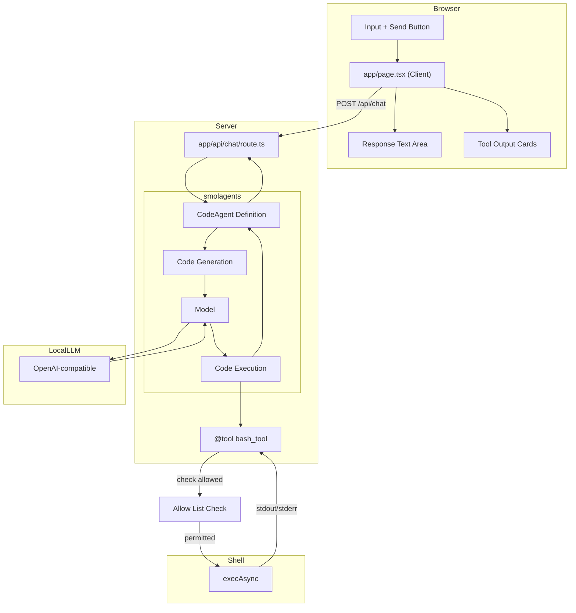

# Simple LLM Chat Interface

## Project Overview

A minimal chat interface that connects to a OpenAI-compatible LLM with bash execution capabilities. The app allows users to send prompts and receive responses, with the LLM able to invoke a `bash` tool to execute shell commands.

Built with smolagents' code-first paradigm — a `CodeAgent` generates Python code snippets to invoke tools and solve tasks. Tools are registered via `@tool` decorator or by subclassing `Tool`. The agent executes its generated code locally or in a sandbox, returning results via `final_answer()`.

---

## Architecture

```
┌─────────────────────────────────────────────────────────────┐
│                    User Browser                              │
│                                                             │
│  ┌───────────────────────────────────────────────────────┐  │
│  │              app/page.tsx (Client)                    │  │
│  │  ┌─────────────┐       ┌──────────────┐              │  │
│  │  │   Input     │──────▶│   Response   │              │  │
│  │  │   Text +    │       │   Text Area  │              │  │
│  │  │   Button    │       └──────────────┘              │  │
│  │  └─────────────┘                                     │  │
│  │        │                                             │  │
│  │        │ fetch POST /api/chat                        │  │
│  │        ▼                                             │  │
│  └───────────────────────────────────────────────────────┘  │
└─────────────────────────────────────────────────────────────┘
                        │
                        │ HTTP POST
                        ▼
┌─────────────────────────────────────────────────────────────┐
│              app/api/chat/route.ts                          │
│                                                             │
│  ┌─────────────────┐    ┌───────────────────────────────┐   │
│  │ CodeAgent.run() │───▶│ bash Tool (@tool decorated)  │   │
│  │                 │    │  - Python function           │   │
│  │                 │    │  - execAsync(cmd, timeout)   │   │
│  │  ┌────────────┐ │    │  - 30s timeout              │   │
│  │  │   prompt   │ │    │  - returns stdout/stderr     │   │
│  │  └────────────┘ │    └───────────────────────────────┘   │
│  │        │        │    ▲                            │      │
│  │        └─────────┼────────────────────────────┘         │
│  │            │       │                                     │
│  │            ▼       │                                     │
│  │  ┌──────────────┐  │                                     │
│  │  │  Result      │◀─┼─────────────────────────────────────┤
│  │  │  - output    │  │                                     │
│  │  │  - steps────┘                                │      │
│  │  └──────────────┘                                   │      │
│  └─────────────────┘                                   │      │
│        │                                               │      │
└────────┼────────────────────────────────────────────────┘      │
         │                                                       │
         │ OpenAI-compatible API call                            │
         │ max_steps: 30 (default)                               │
         │ Allow List Check                                      │
         │                                                       │
         ▼
┌────────────────────────────────────────────────────────────────────┐
│                    LLM via URL                                     │
└────────────────────────────────────────────────────────────────────┘
```

---

## Mermaid Architecture Diagram



---

## Technical Stack

| Layer | Technology | Version |
|-------|------------|---------|
| **Framework** | Next.js | 16.2.10 (App Router) |
| **UI** | React | 19.2.4 |
| **Agent Framework** | smolagents (Hugging Face) | 1.x |
| **Validation** | Pydantic | 2.x |
| **Styling** | Tailwind CSS | v4 |
| **Type Safety** | TypeScript | 5.x |
| **Fonts** | Geist Sans/Mono | (via Tailwind v4) |

---

## Key Components

### `app/page.tsx`

**Type**: Client Component (`'use client'`)  
**Purpose**: Chat UI with input, response display, and tool output visualization

```tsx
useState hooks:
  - prompt: Input field value
  - response: LLM response text
  - toolOutputs: Array of bash tool execution results
  - loading: Button/input disabled state

send():
  - POST to /api/chat with { prompt }
  - Update response and toolOutputs on success
```

### `app/api/chat/route.ts`

**Type**: Server API Route (POST)  
**Purpose**: Orchestrate LLM inference via a smolagents CodeAgent

```tsx
Key imports (Python):
  - CodeAgent from smolagents
  - LiteLLMModel from smolagents.models

Key exports:
  - POST(req: NextRequest)

Configuration:
  - model: LiteLLMModel with openai-compatible baseURL
  - tools: [@tool decorated function]
  - agent: CodeAgent with tools, model
  - run(): agent.run(prompt) → string output
```

### `app/globals.css`

**Type**: Global Styles  
**Purpose**: Tailwind v4 setup with system theme detection

```css
Tailwind v4 syntax:
  @import "tailwindcss"
  @theme inline { ... }

Features:
  - System color scheme detection (light/dark)
  - CSS custom properties for theming
  - Geist font family configuration
```

---

## LLM Configuration

```python
from smolagents import LiteLLMModel

model = LiteLLMModel(
    model_id="modelName",
    api_base="baseUrl",
    api_key="example",
)
```

| Setting | Value |
|---------|-------|
| **Model ID** | `modelName` |
| **Base URL** | `baseUrl` |
| **API Key** | `example` |
| **Provider Type** | OpenAI-compatible (via LiteLLM) |
| **Max Tokens** | Model-dependent |

Configuration data is persisted to a file called llm-config.json

---

## Bash Tool Design

### Schema Definition

smolagents uses the `@tool` decorator to turn Python functions into agent-accessible tools. Type hints and docstrings are auto-converted into tool schemas.

```python
import json
import subprocess
from smolagents import tool

ALLOW_LIST = {"ls", "pwd"}
ALLOW_ALL = False

@tool
def bash_tool(command: str) -> str:
    """Execute a bash command on the server.
    
    You MUST provide a "command" parameter with the exact shell command to run.
    This is the ONLY way to run commands. For example: command="pwd", 
    command="ls -la", command="npm run build".
    
    Args:
        command: The bash/shell command to execute
        
    Returns:
        JSON string with stdout, stderr, and optional error
    """
    base_cmd = command.split()[0] if command.strip() else ""
    if base_cmd not in ALLOW_LIST and not ALLOW_ALL:
        return json.dumps({
            "error": f"Command '{base_cmd}' not allowed",
            "stdout": "",
            "stderr": ""
        })
    
    try:
        result = subprocess.run(
            command, shell=True, capture_output=True, text=True, timeout=30
        )
        return json.dumps({
            "stdout": result.stdout.strip(),
            "stderr": result.stderr.strip()
        })
    except subprocess.TimeoutExpired:
        return json.dumps({
            "error": "Command timed out (30s)",
            "stdout": "",
            "stderr": ""
        })
    except Exception as e:
        return json.dumps({
            "error": str(e),
            "stdout": "",
            "stderr": ""
        })
```

### Execution Configuration

| Setting | Value |
|---------|-------|
| **Command Runner** | `subprocess.run()` (synchronous) |
| **Timeout** | 30,000 ms (30 seconds) |
| **Captured Output** | `stdout`, `stderr`, `error` |
| **Max Steps** | 30 (default) |

### Allow List Filtering

The bash tool enforces an allow list that restricts which commands can be executed. Before running a command, the tool checks if the base command (first word) is in the allow list.

### Return Types

smolagents tool results are captured as strings in the agent's execution logs:

```python
# Success (returned as string)
json.dumps({
    "stdout": str,    # Trimmed
    "stderr": str     # Trimmed
})

# Error (returned as string)
json.dumps({
    "error": str,     # Error message
    "stdout": str,    # Trimmed (may be partial)
    "stderr": str     # Trimmed
})
```

---

## Command Allow List

### Default Allow List

By default, the allow list includes:
- `ls` - List directory contents
- `pwd` - Print working directory

### User Editable

Users can modify the allow list through the web app UI:
- **Add commands**: Enter a new command to add it to the list
- **Remove commands**: Click the remove button next to any command

### Allow All Mode

A toggle setting enables "Allow All" mode:
- **Enabled**: The allow list is ignored; any command the LLM generates will execute
- **Disabled**: Only commands in the allow list are permitted

---

## Design Patterns

### 1. Client-Server Separation

- **Client** (`page.tsx`): UI-only, no API credentials
- **Server** (`api/chat/route.ts`): Holds API key, makes LLM calls
- **Benefit**: API key never exposed to browser

### 2. smolagents CodeAgent Pattern

```python
from smolagents import CodeAgent, LiteLLMModel, tool
import json
import subprocess

ALLOW_LIST = {"ls", "pwd"}
ALLOW_ALL = False

# Step 1: Define the model
model = LiteLLMModel(
    model_id="modelName",
    api_base="baseUrl",
    api_key="example",
)

# Step 2: Define the tool
@tool
def bash_tool(command: str) -> str:
    """Execute a bash command on the server.
    
    You MUST provide a "command" parameter with the exact shell command to run.
    This is the ONLY way to run commands. For example: command="pwd", 
    command="ls -la", command="npm run build".
    
    Args:
        command: The bash/shell command to execute
    """
    base_cmd = command.split()[0] if command.strip() else ""
    if base_cmd not in ALLOW_LIST and not ALLOW_ALL:
        return json.dumps({
            "error": f"Command '{base_cmd}' not allowed",
            "stdout": "",
            "stderr": ""
        })
    
    try:
        result = subprocess.run(
            command, shell=True, capture_output=True, text=True, timeout=30
        )
        return json.dumps({
            "stdout": result.stdout.strip(),
            "stderr": result.stderr.strip()
        })
    except subprocess.TimeoutExpired:
        return json.dumps({
            "error": "Command timed out (30s)",
            "stdout": "",
            "stderr": ""
        })
    except Exception as e:
        return json.dumps({
            "error": str(e),
            "stdout": "",
            "stderr": ""
        })

# Step 3: Create the CodeAgent
agent = CodeAgent(
    tools=[bash_tool],
    model=model,
    max_steps=30,
    additional_authorized_imports=["json", "subprocess"],
)

# Step 4: Run the agent
result = agent.run(prompt)
# result is a string (the final_answer output)

# Step 5: Inspect the run
# agent.logs stores fine-grained logs of each step
# agent.write_memory_to_messages() returns chat message history
```

**Key smolagents concepts used**:
- `CodeAgent` — generates Python code snippets to invoke tools, performs computations, and returns `final_answer()`
- `CodeAgent` vs `ToolCallingAgent` — two paradigms: code generation vs structured JSON tool calls
- `@tool` — decorator that turns a Python function into a tool; type hints and docstrings auto-generate the schema
- `additional_authorized_imports=["json", "subprocess"]` — allows the agent to import these modules in generated code
- `max_steps=30` — maximum number of execution steps before termination
- `final_answer(value)` — special function the agent calls to return its final result
- `final_answer_checks=[validator_func]` — list of validation functions that check the final answer
- `agent.logs` — fine-grained logs of each step (each step stored as a dict)
- `agent.write_memory_to_messages()` — returns chat message history for the model
- **Code execution** — generated Python code is executed locally (safe by default) or in a sandbox (`executor_type="docker"`, `"e2b"`, `"blaxel"`)
- **Import safety** — Python interpreter doesn't allow imports outside a safe list by default; `additional_authorized_imports` extends this
- **Multi-agent** — pass `managed_agents=[...]` to create hierarchical multi-agent systems
- **Sub-agents** — agents with `name` and `description` attributes can be managed by a parent agent
- **Push to Hub** — `agent.push_to_hub("user/agent-name")` to share agents
- **Load from Hub** — `CodeAgent.from_hub("user/agent-name", trust_remote_code=True)` to load shared agents
- **GradioUI** — `GradioUI(agent).launch()` for interactive chat with visualization

### 3. Tool Output Visualization

```python
# From agent.logs or write_memory_to_messages():
step.tool_output:
  ├─ stdout → Green-tinted card with dark terminal background
  ├─ stderr → Red-tinted card for error streams
  └─ error  → Inline error message (execution failed)
```

---

## Key Dependencies

```json
{
  "dependencies": {
    "smolagents": "^1.x",
    "litellm": "^1.x",
    "next": "16.2.10",
    "react": "19.2.4",
    "react-dom": "19.2.4"
  },
  "devDependencies": {
    "@tailwindcss/postcss": "^4",
    "@types/node": "^20",
    "@types/react": "^19",
    "@types/react-dom": "^19",
    "eslint": "^9",
    "eslint-config-next": "16.2.10",
    "tailwindcss": "^4",
    "typescript": "^5"
  }
}
```

---

## Development Workflow

```bash
# Start development server
bun dev

# Build for production
bun build

# Run production server
bun start
```

Access at `http://localhost:3000`

---

## Data Flow Summary

1. **User** types prompt and clicks Send
2. **Client** sends `POST /api/chat` with `{ prompt }`
3. **API Route** creates a smolagents `CodeAgent` with model, bash tool, and authorized imports
4. **Agent** generates Python code to invoke `bash_tool(command="...")`
5. **CodeAgent** executes the generated code locally (safe by default)
6. **LLM** generates code based on prompt and available tools
7. **bash_tool()** executes command via `subprocess.run()` (30s timeout)
   - **Allow List Check** verifies the base command is permitted (or "Allow All" is enabled)
8. **Agent** iterates: generates code → executes → observes output → generates more code
9. **Agent** calls `final_answer(result)` when done (or `max_steps` reached)
10. **API Route** returns `{ text: result, toolOutputs[] }` from agent logs
11. **Client** displays response text and tool output cards

---

## UI Behavior

### Autoscroll Behavior
- Uses `useLayoutEffect` + `setTimeout(..., 0)` pattern to autoscroll chat to bottom
- Triggers on changes to `messages` array or `loading` state
- Scrolls by setting `container.scrollTop = scrollHeight`
- This is a hard jump (no smooth scrolling animation)
- Unconditionally scrolls user back to bottom even if they scrolled up mid-conversation
- No scroll preservation or intersection observer for smart scrolling

### Chat Container Styling
- `flex-1 min-h-0 overflow-y-auto px-8 py-6 pb-20 space-y-6`
- `overflow-y-auto` enables scrolling
- `pb-20` provides bottom padding so content isn't hidden behind the sticky input bar

### Input Bar Behavior
- `sticky bottom-0` keeps input bar fixed at bottom of chat card
- Has `data-input-bar` attribute

### Typing Indicator Animation
- Three dots with staggered `animate-bounce` (Tailwind CSS)
- Animation delays: 0ms, 150ms, 300ms

### Other UI Effects
- Dark mode toggle: `transition-colors` on button
- Input field: `transition-shadow` on focus
- Send button: `transition-all` + `active:scale-[0.98]` press feedback
- Send button disabled state: `disabled:opacity-40`

### Notes on Scrolling
- No `smooth` scrolling — hard jump via direct scrollTop assignment
- No scroll preservation — user is always scrolled to bottom on new messages
- No `scrollIntoView` with `behavior: 'smooth'`
- No intersection observer or smart scroll detection

---

## Future Considerations

- **Multi-agent**: Use `managed_agents=[...]` for hierarchical agent teams
- **Sub-agents**: Create agents with `name` and `description` for parent delegation
- **Sandboxed execution**: Use `executor_type="docker"` or `"e2b"` for secure code execution
- **Push to Hub**: Share agents via `agent.push_to_hub("user/name")`
- **Load from Hub**: Load shared agents via `CodeAgent.from_hub("user/name")`
- **Final answer checks**: Add `final_answer_checks=[validator]` for output validation
- **ToolCallingAgent**: Use `ToolCallingAgent` for structured JSON tool calls (less expressive, more reliable)
- **Base tools**: Add `add_base_tools=True` for DuckDuckGo search, Python interpreter, transcriber
- **Model providers**: Use `InferenceClientModel`, `OpenAIModel`, `AzureOpenAIModel`, `AmazonBedrockModel`, `MLXModel`
- **Add request/response logging**
- **Configure environment variables for API credentials**
- **Add loading states for individual tool calls**
- **Support streaming tool outputs via SSE**

---

## smolagents vs Vercel AI SDK: Key Mapping

| Vercel AI SDK | smolagents |
|---------------|------------|
| `generateText()` | `CodeAgent.run(prompt)` |
| `tool({ parameters, execute })` | `@tool` decorated function |
| `maxSteps: 5` | `max_steps=30` |
| Tool result as object | Tool result as string |
| Built-in streaming (`useChat`) | Not built-in (GradioUI for interactive) |
| Auto message history | `agent.write_memory_to_messages()` |
| Implicit tool routing | Agent generates Python code to call tools |
| `ai` package | `smolagents` (Hugging Face) |
| TypeScript-first | Python-first |

## smolagents vs LangChain: Key Mapping

| LangChain (createReactAgent) | smolagents |
|------------------------------|------------|
| `createReactAgent({ llm, tools })` | `CodeAgent(tools=[...], model=model)` |
| `StateGraph` with nodes/edges | Implicit code generation loop |
| `maxIterations: 5` | `max_steps=30` |
| `MemorySaver` / `SqliteSaver` | `agent.write_memory_to_messages()` |
| `invoke()` | `run(prompt)` |
| `stream()` | Not built-in |
| Explicit message management | `agent.logs` + `write_memory_to_messages()` |
| `thread_id` in configurable | Not built-in |
| `class extends Tool` | `@tool` decorated function |

## smolagents vs CrewAI: Key Mapping

| CrewAI | smolagents |
|--------|------------|
| `Crew.kickoff()` | `CodeAgent.run(prompt)` |
| `new Agent({ role, goal, tools })` | `CodeAgent(tools=[...], model=model)` |
| `new Task({ description, agent })` | `agent.run(prompt)` (prompt is inline) |
| `process: 'sequential'` | Single agent (managed_agents for multi) |
| `maxIter: 5` | `max_steps=30` |
| Tool as class | `@tool` decorated function |
| 3-layer: Agent → Task → Crew | 1-layer: Agent |

## smolagents vs Agno: Key Mapping

| Agno | smolagents |
|------|------------|
| `Agent.run(user=prompt)` | `CodeAgent.run(prompt)` |
| Python function as tool | `@tool` decorated function |
| `tool_call_limit=5` | `max_steps=30` |
| `RunOutput` | String (final_answer output) |
| `stream=True` | Not built-in |
| `session_id` | Not built-in |
| Automatic agent loop | Automatic code generation loop |
| `Agent` (1 primitive) | `CodeAgent` + `ToolCallingAgent` (2 agents) |
| `Team` / `Workflow` primitives | `managed_agents` for multi-agent |
| Type safety | Type hints for tool schemas |

## smolagents vs LangGraph: Key Mapping

| LangGraph | smolagents |
|-----------|------------|
| `StateGraph().addNode().compile()` | `CodeAgent()` — implicit code loop |
| `Annotation.Root` state | No explicit state |
| `maxIter: 5` | `max_steps=30` |
| `MemorySaver` | `agent.write_memory_to_messages()` |
| `invoke()` | `run(prompt)` |
| `stream()` | Not built-in |
| Explicit nodes/edges | Agent generates Python code |
| `interrupt` (HITL) | `agent.interrupt()` |
| Python + JS | Python-only |

## smolagents vs Microsoft Agent Framework: Key Mapping

| MAF | smolagents |
|-----|------------|
| `Agent.run(prompt, session=session)` | `CodeAgent.run(prompt)` |
| `@tool` decorated function | `@tool` decorated function |
| `FunctionInvocationContext` | Not built-in |
| Provider max iterations | `max_steps=30` |
| `AgentResult` | String (final_answer) |
| `agent.create_session()` | Not built-in |
| Automatic agent loop | Automatic code generation loop |
| Harness / Workflow | managed_agents for multi-agent |
| Multi-language | Python-only |

## smolagents vs Pydantic AI: Key Mapping

| Pydantic AI | smolagents |
|-------------|------------|
| `Agent.run(prompt, deps=deps)` | `CodeAgent.run(prompt)` |
| `@agent.tool` decorated function | `@tool` decorated function |
| `UsageLimits(tool_call_limit=5)` | `max_steps=30` |
| `AgentRunResult` | String (final_answer) |
| `run_stream()` | Not built-in |
| `agent.create_session()` | Not built-in |
| Automatic agent loop | Automatic code generation loop |
| `Agent[DepT, OutputT]` | No type parameters |
| Capabilities | managed_agents for multi-agent |

## smolagents vs LlamaIndex Workflows: Key Mapping

| LlamaIndex Workflows | smolagents |
|---------------------|------------|
| `Workflow.run(input=...)` | `CodeAgent.run(prompt)` |
| `@step` functions with typed events | `@tool` decorated functions |
| `Event` classes | No explicit events |
| `ctx.store` | Not built-in |
| `timeout=120` | `max_steps=30` |
| `FunctionTool.from_defaults(func)` | `@tool` decorated function |
| Event-driven loops | Code generation loop |
| `Workflow` + `Event` + `@step` | `CodeAgent` + `@tool` |
| Python-first | Python-first |
