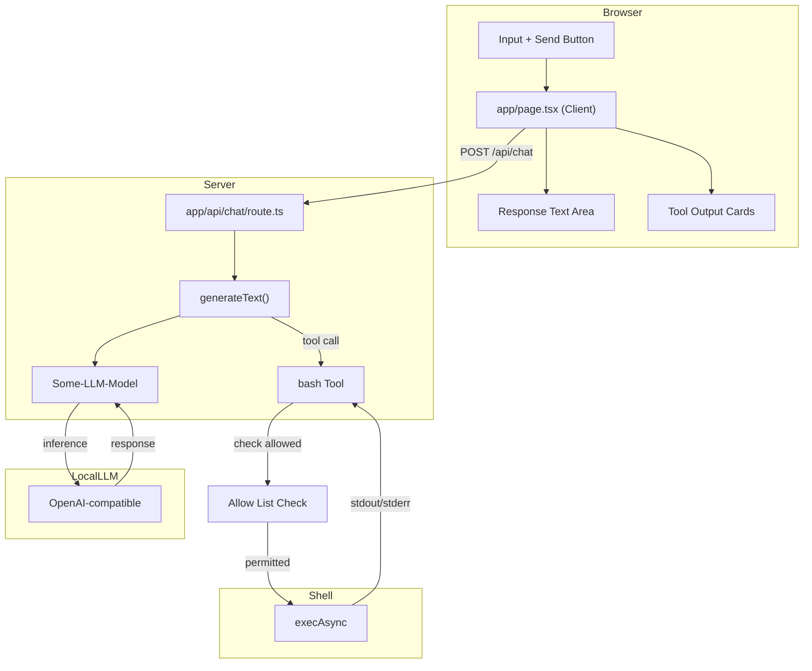

# Simple LLM Chat Interface

## Project Overview

A minimal chat interface that connects to a OpenAI-compatible LLM  with bash execution capabilities. The app allows users to send prompts and receive responses, with the LLM able to invoke a `bash` tool to execute shell commands.

---

## Architecture

```
┌─────────────────────────────────────────────────────────────┐
│                    User Browser                              │
│                                                             │
│  ┌───────────────────────────────────────────────────────┐  │
│  │              app/page.tsx (Client)                    │  │
│  │  ┌─────────────┐       ┌──────────────┐              │  │
│  │  │   Input     │──────▶│   Response   │              │  │
│  │  │   Text +    │       │   Text Area  │              │  │
│  │  │   Button    │       └──────────────┘              │  │
│  │  └─────────────┘                                     │  │
│  │        │                                             │  │
│  │        │ fetch POST /api/chat                        │  │
│  │        ▼                                             │  │
│  └───────────────────────────────────────────────────────┘  │
└─────────────────────────────────────────────────────────────┘
                        │
                        │ HTTP POST
                        ▼
┌─────────────────────────────────────────────────────────────┐
│              app/api/chat/route.ts                          │
│                                                             │
│  ┌─────────────────┐    ┌───────────────────────────────┐   │
│  │ generateText()  │───▶│ bash Tool (via ai SDK)       │   │
│  │                 │    │  - Zod schema                │   │
│  │  ┌────────────┐ │    │  - execAsync(cmd, timeout)   │   │
│  │  │   prompt   │ │    │  - 30s timeout              │   │
│  │  └────────────┘ │    │  - returns stdout/stderr     │   │
│  │        │        │    └───────────────────────────────┘   │
│  │        │           ▲                            │         │
│  │        └───────────┼────────────────────────────┘         │
│  │            │       │                                     │
│  │            ▼       │                                     │
│  │  ┌──────────────┐  │                                     │
│  │  │  Return JSON │◀─┼─────────────────────────────────────┤
│  │  │  - text      │  │                                     │
│  │  │  - toolOutputs──┘                                │      │
│  │  └──────────────┘                                   │      │
│  └─────────────────┘                                   │      │
│        │                                               │      │
└────────┼────────────────────────────────────────────────┘      │
         │                                                       │
         │ OpenAI-compatible API call                            │
         │ maxSteps: 5                                           │
         │ Allow List Check                                      │
         │                                                       │
         ▼
┌────────────────────────────────────────────────────────────────────┐
│                    LLM via URL                                     │
└────────────────────────────────────────────────────────────────────┘
```

---

## Mermaid Architecture Diagram



---

## Technical Stack

| Layer | Technology | Version |
|-------|------------|---------|
| **Framework** | Next.js | 16.2.10 (App Router) |
| **UI** | React | 19.2.4 |
| **AI SDK** | Vercel AI SDK | 7.0.34 |
| **Provider** | @ai-sdk/openai-compatible | 3.0.14 |
| **Validation** | Zod | 3.25.0 |
| **Styling** | Tailwind CSS | v4 |
| **Type Safety** | TypeScript | 5.x |
| **Fonts** | Geist Sans/Mono | (via Tailwind v4) |

---

## Key Components

### `app/page.tsx`

**Type**: Client Component (`'use client'`)  
**Purpose**: Chat UI with input, response display, and tool output visualization

```tsx
useState hooks:
  - prompt: Input field value
  - response: LLM response text
  - toolOutputs: Array of bash tool execution results
  - loading: Button/input disabled state

send():
  - POST to /api/chat with { prompt }
  - Update response and toolOutputs on success
```

### `app/api/chat/route.ts`

**Type**: Server API Route (POST)  
**Purpose**: Orchestrate LLM inference and tool execution

```tsx
Key exports:
  - POST(req: NextRequest)

Configuration:
  - localProvider: createOpenAICompatible()
  - model: ModelName
  - tools: { bash }
  - maxSteps: 5
```

### `app/globals.css`

**Type**: Global Styles  
**Purpose**: Tailwind v4 setup with system theme detection

```css
Tailwind v4 syntax:
  @import "tailwindcss"
  @theme inline { ... }

Features:
  - System color scheme detection (light/dark)
  - CSS custom properties for theming
  - Geist font family configuration
```

---

## LLM Configuration

```ts
const localProvider = createOpenAICompatible({
  name: 'provider-name',
  baseURL: 'baseUrl',
  apiKey: 'example',
});

const model = localProvider('modelName', {
  maxRetries: 0,
});
```

| Setting | Value |
|---------|-------|
| **Model** | `modelName` |
| **Base URL** | `baseUrl` |
| **API Key** | `example` |
| **Provider Type** | `openai-compatible` |
| **Max Retries** | `0` (no retries) |

---

## Bash Tool Design

### Schema Definition

```ts
const bashTool = tool({
  description: `Execute a bash command on the server. You MUST provide a "command" 
  parameter with the exact shell command to run. This is the ONLY way to run 
  commands. For example: command="pwd", command="ls -la", command="npm run build".`,
  
  parameters: z.object({
    command: z.string().describe('The bash/shell command to execute'),
  }),
  
  execute: async ({ command }) => { ... }
});
```

### Execution Configuration

| Setting | Value |
|---------|-------|
| **Command Runner** | `child_process.exec` (promisified) |
| **Timeout** | 30,000 ms (30 seconds) |
| **Captured Output** | `stdout`, `stderr`, `error` |
| **maxSteps** | 5 (multi-step reasoning) |

### Allow List Filtering

The bash tool enforces an allow list that restricts which commands can be executed. Before running a command, the tool checks if the base command (first word) is in the allow list.

### Return Types

```ts
// Success
{
  stdout: string,  // Trimmed
  stderr: string   // Trimmed
}

// Error
{
  error: string,   // Error message
  stdout: string,  // Trimmed (may be partial)
  stderr: string   // Trimmed
}
```

---

## Command Allow List

### Default Allow List

By default, the allow list includes:
- `ls` - List directory contents
- `pwd` - Print working directory

### User Editable

Users can modify the allow list through the web app UI:
- **Add commands**: Enter a new command to add it to the list
- **Remove commands**: Click the remove button next to any command

### Allow All Mode

A toggle setting enables "Allow All" mode:
- **Enabled**: The allow list is ignored; any command the LLM generates will execute
- **Disabled**: Only commands in the allow list are permitted

---

## Design Patterns

### 1. Client-Server Separation

- **Client** (`page.tsx`): UI-only, no API credentials
- **Server** (`api/chat/route.ts`): Holds API key, makes LLM calls
- **Benefit**: API key never exposed to browser

### 2. Vercel AI SDK Tool Calling

```tsx
generateText({
  model,
  prompt,
  tools: { bash: bashTool },
  maxSteps: 5,  // Allows up to 5 tool call/response cycles
})
```

### 3. Tool Output Visualization

```tsx
toolOutputs[].result:
  ├─ stdout → Green-tinted card with dark terminal background
  ├─ stderr → Red-tinted card for error streams
  └─ error  → Inline error message (execution failed)
```

---

## Key Dependencies

```json
{
  "dependencies": {
    "@ai-sdk/openai-compatible": "^3.0.14",
    "ai": "^7.0.34",
    "zod": "^3.25.0",
    "next": "16.2.10",
    "react": "19.2.4",
    "react-dom": "19.2.4"
  },
  "devDependencies": {
    "@tailwindcss/postcss": "^4",
    "@types/node": "^20",
    "@types/react": "^19",
    "@types/react-dom": "^19",
    "eslint": "^9",
    "eslint-config-next": "16.2.10",
    "tailwindcss": "^4",
    "typescript": "^5"
  }
}
```

---

## Development Workflow

```bash
# Start development server
bun dev

# Build for production
bun build

# Run production server
bun start
```

Access at `http://localhost:3000`

---

## Data Flow Summary

1. **User** types prompt and clicks Send
2. **Client** sends `POST /api/chat` with `{ prompt }`
3. **API Route** calls `generateText()` with prompt + bash tool
4. **LLM** processes prompt, may call bash tool (up to 5 steps)
5. **Bash Tool** executes command via `execAsync()` (30s timeout)
   - **Allow List Check** verifies the base command is permitted (or "Allow All" is enabled)
6. **API Route** returns `{ text, toolOutputs[] }`
7. **Client** displays response text and tool output cards

---

## Future Considerations

- Allow list enhancements: wildcard patterns (`ls*`), regex matching, per-session settings, shared team defaults
- Add streaming responses via `useChat` hook
- Support multi-turn conversation history
- Add request/response logging
- Configure environment variables for API credentials
- Add loading states for individual tool calls
- Support streaming tool outputs
